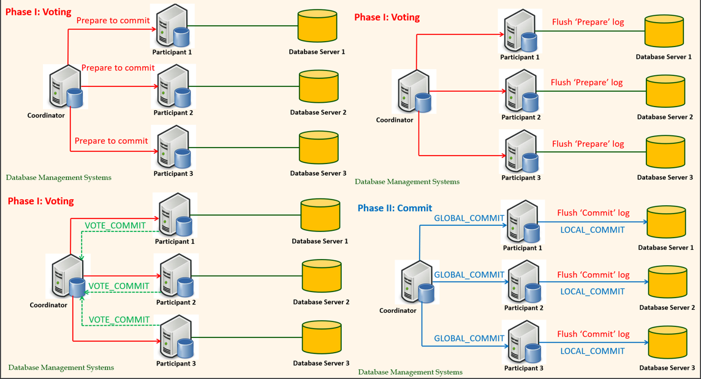

# ADB Final

## 1st Week

### Keywords: Disk access time, Memory access time, SSD, Moore's law, Joy's law, Database archtecture

### Disk Access time

Disk access time(HDD) = seek time + rotational time + transfer length/bandwitdth  
Disk access time(SSD) = transfer length/bandwitdth  

### Laws

Moore's law(memory chip): Chip capacity = $2^{\frac{2*(year-1970)}{3}}KB/chip$  
Joy's law(processor): Processor performance = $2^{(year-1984)/2} mips$  

### Memory access time

Effective memory access time: EA = H*C+(1-H)*M  
Hit ratio = $\frac{references\ satisfied\ by\ cache}{total references}$  
H: hit ratio, C: cache access time, M: memory access time

### Types of database systems

- Simple file: plain text file
- RDBS: collection of tables
- Object oriented: Datastored in Objects
- No-SQL: Non relational database

### Database architectures

- Centralized: Data stored in one place. 特性: suitable for simple applications, easy to manage; may not scale well
- Distributed:  Data distributed across several nodes, can be in different locations特性Scalable, suitable for large applications and applications that need data access from different physical locations; System administration and crash recovery is difficult, usually have some data inconsistency
- WWW: Stored all over the world, several owners of the data 特性：Very convenient to access and share data; security issues, no guarantee on availability or consistency
- Grid: Like distributed, but each node manages own resource; system doesn’t act as a single unit.特性Less used now-a-days, very similar to distributed systems with administration done locally by each owner
- P2P: Like grid, but nodes can join and leave network at will (unlike Grid)特性Suitable when the nodes of the network cannot be planned in advance, or some may leave and join frequently. For example, sensor network
- Cloud: Generalization of grid, but resources are accessed on demand.特性on-demand resources, cost-effective, maintenance done externally by the cloud provider; some privacy and confidentially issue – but most trusted providers well address them

## 2nd 3rd Week

**Keywords:Storage area networks(SAN)**

### terminology

Mean time to failure: the time elapsed before a failure occurs

Mean time between failure: 和mttf一样的概念但是mtbf常用于repairable system。mttf常用于non-repairable system.

mean time to repair: the time elapsed when the service is down in a repairable system.

### ACID  

- Atomicity: A transaction’s changes to the state (Database) are atomic implying either all actions happen or none happen.
- Consistency: Transaction are a correct transformation of the state. Actions taken as a whole by a transaction do not violate the integrity of the application state. That is we are assuming transactions are correct programs. Concurrent execution of transactions does not violate consistency of data. Data is in a ‘consistent’ state when a transaction starts and when it ends     - in other words, any data written to the database must be valid according to all defined rules
- Isolation: Transaction are executed as if it is the only one in the system. Even when several transactions are executed simultaneously, it appears to each transaction T that others executed either happen before T or after T but not at the same time.
- Durability: State changes committed by a transaction survive failures. The system should tolerate system failures and any committed updates should not be lost.

### Fault tolerance by RAID

- RAID 0 (block level striping)
  - striping at block level
  - throughput double and MTTF(mean time to failure) half
  - MTTF/2
- RAID 1 (mirroring)
  - higher read throughput
  - lower write throughput
  - half storage utilization
  - $MTTF^2$
- RAID 2 (bit level striping)
  - similar to raid 0, striping 1 bit level
  - MTTF/2
- RAID 3 (byte level striping)
  - byte level striping
  - transfer rate > RAID 0
  - $MTTF^2/3$
  - parity
- RAID 4 (block level striping)
  - similar to RAID 3
  - Dedicated disk for parity blocks
  - higher throughput but very slow writes
  - $MTTF^2/3$
- RAID 5 (block level striping)
  - similar to RAID 4, parity blocks are also striped
  - Provides higher throughput but slower writes but better than RAID 4 as Parity bits are distributed among all disks and the number of write operations on average equal among all 3 disks.
  - $MTTF^2/3$
- RAID 6 (block level striping)
  - similar to RAID 5 two parity blocks used
  - $MTTF^3/10$(two disk breakdown tolerance)
  

### Fault tolerance by voting

- **failvote**: stop if there are no majority agreement
- **failfast**: uses the majority of the available modules.
- **Supermodule**: Naturally, a system with multiple hard disk drives is expected to function with only one working disk (use voting when multiple disks are working/available, but still work even when only one is available)

十个盘里坏了5个failvote就罢工，坏9个failfast罢工,supermodel继续工作

### Fault tolerance with repair

**With repair of modules**: the faulty equipment is repaired with an average time of MTTR (mean time to repair) as soon as a fault is detected.  

Probability of a particular module is not available = $MTTR/(MTTF+MTTR) = MTTR/MTTF$ (MTTF >> MTTR)  

Probability that (n-1) modules are unavailable:$P_{n-1} = (\frac{MTTR}{MTTF})^{n-1}$

Probability that a particular module fails: $P_{i} = \frac{1}{MTTF}$

Probability that the system fails with a particular module failing last: $P_{n-1}*P_{i}$

Probability that a supermodule fails due to any one of the n modules failing last, when other (n-1) modules are unavailable $n*P_{n-1}*P_{i}$

### Old master - new master technique

- record all updates (transactions) to be performed in a separate file
- at night (usually) produce a separate new (next day) master using the old (previous day’s) master and the batch updates (transactions).
- Not online processing, transaction failure is not notified until next day
  
### Software reliability

#### Main distinction between software and hardware reliability

- Hardware reliability requires tolerating component failures.
- Software reliability requires tolerating design and coding faults.
- The distinction between Hardware and Software is becoming less as most hardware units have substantial amount of software components

#### Improvement

1. N-version programming
   - use n programs that run in parallel, take majority vote for each answer
   - the diversity of design and coding can mask many failures
2. Software reliability as 'transaction' (Abort and restart)
   - Write a program as an ACID state transformation with consistency checks. If the consistency checks are not met (fault), abort the transaction and restart
   - A recent consistent system state is restored after restart
   - Restarting an application without proper recovery (repair) can make the systems very unreliable
   - **Bohrbugs**: deterministic bugs, relatively easy to handle
   - **Heisenbugs**: software errors that only appear occasionally
3. Process pairing
   - Primary process does all the work until it fails. The second process (backup) takes over the primary and continues.
   - Primary needs to tell on a regular basis that it is alive and also transmit its state to the secondary.
   - three ways to takeover
     - Checkpoint-restart: The primary records its state on a second storage module. At takeover the secondary starts reading the state of the primary from the storage and resumes the application. (全记录)
     - Checkpoint messages: The primary sends its state changes as messages to the backup. At takeover the backup gets its current state from the most recent checkpoint message.（只记录改变）
     - Persistent: backup restarts in the null state and lets Transaction mechanism to clean up all uncommitted transactions. This is the approach taken by the most Database Systems.(现在最常用的)

## 4th 5th Week

### Keywords: Communication, Transaction

### Communication reliability

### Improving system’s reliability

- Improving Hardware reliability that is CPUs, Memory and Storage Units. This can be done by employing lot of redundancy
- Software reliability can be improved by employing process-pairing or transaction-based recovery.
- Communication Systems reliability not only need hardware redundancy but also need to guaranty transmission and reception of messages using stable storage and acknowledgements

### Database transaction

Transaction: a unit of work in a database

- A transaction can have any number and type of operations in it
- Transactions ideally have four properties, commonly known as ACID properties

#### Duplex write

- Each block of data is written in two places sequentially
- If one of the writes fail, system can issue another write
- Each block is associated with a version number. The block with the latest version number contains the most recent data.
- While reading - we can determine error of a disk block by its Cyclic Redundancy Check (CRC).
- It always guarantees at least one block has consistent data.

#### Logged write

- Similar to duplex write, except one of the writes goes to a log. This method is very efficient if the changes to a block are small.

#### Cyclic Redundancy Check (CRC)

To compute an n-bit binary CRC

1. Add n zero bits as ‘padding’ to the right of the input bits.  
2. Compute the (n + 1)-bit pattern representing the CRC's divisor (called a "polynomial")
3. Position the (n + 1)-bit pattern representing the CRC's divisor underneath the left-hand end of the input bits.
4. The algorithm acts on the bits directly above the divisor in each step.
  

Checking validity with CRC

##### An error detection algorithm

1. A polynomial needs to be specified
2. A sequence of bitwise exclusive-or (XOR) operation needs to be performed
3. The final CRC value needs to be stored for each data block (or the data unit on which CRC is performed)
4. Data correctness can be checked with CRC: a) its corresponding CRC value is retrieved.b) A sequence of bitwise XOR operation needs to be performed to find out the correctness of data

### Different transaction

- **Flat transaction**：Any failure of transaction requires lot of unnecessary computation. (一旦出错所有的工作都rollback)
  - Everything inside BEGIN WORK and COMMIT WORK is at the same level; that is, the transaction will either survive together with everything else (commit), or it will be rolled back with everything else (abort)

- **Flat transaction with save points**
- **nested transaction**
  - Commit rule
    - A subtransaction can either commit or abort, however, **commit cannot take place unless the parent itself commits**.
    - Subtransactions have A, C, and I properties but not D property unless all its ancestors commit.
    - Commit of a sub transaction makes its results available only to its parents.
  - Roll back rule
    - If a subtransaction rolls back, all its children are forced to roll back.(父退回时子退回)
  - Visibility Rules
    - Changes made by a subtransaction are visible to the parent only when the subtransaction commits. All objects of parent are visible to its children. Implication of this is that the **parent should not modify objects while children are accessing them**. This is not a problem as parent does not run in parallel with its children.(子提交的父可见，父的所有子可见，子占用时父不占)

### Transaction Processing Monitor (TP monitor)

The main function of a TP monitor is to integrate other system components and manage resources.

- TP monitors manage the transfer of data between clients and servers
- Breaks down applications or code into transactions and ensures that all databases are updated properly
- It also takes appropriate actions if any error occurs

#### TP monitor services

- Heterogeneity: If the application needs access to different DB systems, local ACID properties of individual DB systems is not sufficient. Local TP monitor needs to interact with other TP monitors to ensure the overall ACID property. A form of 2 phase commit protocol must be employed for this purpose.
- Control communication: If the application communicates with other remote processes, the local TP monitor should maintain the communication status among the processes to be able to recover from a crash.
- Terminal management: Since many terminals run client software, the TP monitor should provide appropriate ACID property between the client and the server processes.
- Presentation service: this is similar to terminal management in the sense it has to deal with different presentation (user interface) software -- e.g. X-windows
- Context management: E.g. maintaining the sessions etc.
- Start/Restart: There is no difference between start and restart in TP based system.

#### TP monitor structure

## 6th Week

### Concurrency

Impose exclusive access for correct execution

#### Concurrency Control

To resolve conflicts and preserve database consistency

- [**Dekker's algorithm**](https://www.youtube.com/watch?v=MqnpIwN7dz0) (using code)
  - needs almost no hardware support, needs atomic reads and writes to main memory, That is exclusive access of one time cycle of memory access time!
  - the code is very complicated to implement for more than two transactions
  - harder to understand the algorithm for more than two transactions
  - takes lot of storage space
  - efficient for low lock contention
  - uses busy waiting
- **OS supported primitives**
  - need no special hardware
  - independent of number of processes
  - machine independent
  - through an interrupt call, the lock request is passed to the OS
  - are very expensive (several hundreds to thousands of instructions need to be executed to save context of the requesting process.)
  - do not use busy waiting and therefore more effective
- **Spin locks**(访问之前查看上锁状态)
  - using atomic lock/unlock instructions such as **test and set** or **compare and swap**
  - 缺点need hardware support     - should be able to lock bus (communication channel between CPU and memory + any other devices) for two memory cycles (one for reading and one for writing). During this time no other devices’ access is allowed to this memory location.
  - 优点algorithm does not depend on number of processes
  - 优点 are very efficient for low lock contentions (all DB systems use them)
  - use busy waiting

#### Atomic operation

- Test and set: 查看始否上锁，没上锁就上锁返回true，上了锁返回false
- Compare and swap: 查看始否和旧值相等，相等则赋予新值并返回true，否则重置旧值返回false

### Semaphore

Semaphores derive from the corresponding mechanism used for trains: a train may proceed through a section of track only if the semaphore is clear. Once the train passes, the semaphore is set until the train exits that section of track.

Computer semaphores have a **get()** routine that acquires the semaphore, perhaps waiting until it is free and a dual **give()** routine that returns the semaphore to the free state, perhaps waking up a waiting process.

Semaphores are very simple locks; indeed, they are used to implement
**general-purpose locks**.

Spin locks are the most commonly used locks

#### Implementation of Exclusive mode Semaphore(说白了就是链表排队)

1. Pointer to a queue of processes
2. If the semaphore is busy but there are no waiters, the pointer is the address of the process that owns the semaphore.
3. If some processes are waiting, the semaphore points to a linked list of waiting processes. The process owning the semaphore is at the end of this list.
4. After usage, the owner process wakes up the oldest process in the queue (first in, first out scheduler)

#### Convoy avoiding semaphore

- The previous implementation may result a long list of waiting processes, called convoy
- To avoid convoys, a process may simply free the semaphore (set the queue to null) and then wake up every process in the list after usage.
- In that case, each of those processes will have to re-execute the routine for acquiring semaphore.(重新排队)

### Deadlocks(等对方解锁)

In a deadlock, each process in the deadlock is waiting for another member to release the resources it wants.

deadlock不成立的情况: no cycle in the locks held and requested by the transaction.

#### Solutions

- Have enough resources so that no waiting occurs(不现实)
- Pre-declare all necessary resources and allocate in a single request.(不现实)
- Linearly order the resources and request of resources should follow this order.This type of allocation guarantees no cyclic dependencies among the transactions.
- Periodically check the resource dependency graph for cycles. If a cycle exists - rollback (i.e., terminate) one or more transaction to eliminate cycles (deadlocks). The chosen transactions should be cheap.
- Allow waiting for a maximum time on a lock then force Rollback.
- Many distributed database systems maintain only local dependency graphs and use time outs for global deadlocks.

## 7th Week

### Isolation

Multiple concurrently running transactions may cause conflicts, allow concurrent runs as much as possible for a better performance, while avoiding conflicts as much as possible.  

Isolation ensures that concurrent transactions leaves the database in the same state as if the transactions were executed separately.  

Isolation guarantees consistency, provided each transaction itself is consistent.

When dependency graph has cycles then there is a violation of isolation and a possibility of inconsistency.

#### Conflicts

- write-write (Lost update): 覆盖其他transaction的update
- read-write (Unrepeatable read): 之前读取的被另外一个transaction修改导致再次读取结果不一致
- write-read (Dirty Read): 读取另外一个transaction未提交的结果

#### Dependency relation

In many situation inputs and outputs may be state dependant/not known in prior

H1 = <(T1,R,O1), (T2, W, O5), (T1,W,O3), (T3,W,O1), (T5,R,O3), (T3,W,O2), (T5,R,O4), (T4,R,O2), (T6,W,O4)>  
DEP(H1) = {<T1,O1,T3>, <T1,O3,T5>, <T3,O2,T4>, <T5,O4,T6> }  
H2 = <(T1,R,O1), (T3,W,O1), (T3,W,O2),(T4,R,O2),(T1,W,O3), (T2, W, O5), (T5,R,O3), (T5,R,O4), (T6,W,O4)>  
DEP(H2) = {<T1,O1,T3>, <T1,O3,T5>, <T3,O2,T4>, <T5,O4,T6> }  

DEP(H1)=DEP(H2)

#### Isolated history

- A serial history = an isolated history.
- A serial history is history that is resulted as a consequence of running transactions sequentially one by one.
- N transactions can result in a maximum of N! serial histories.
- Wormhole theorem: A history is isolated if and only if it has no wormholes.

#### Wormhole transaction

$T' \in Before(T) \cap After(T)$  
Exist a cycle in the dependency graph of the history. Presence of a wormhole transaction implies it is not isolated

#### Isolation Theorems

- A transactions is a sequence of READ, WRITE, SLOCK, XLOCK actions on objects ending with COMMIT or ROLLBACK.
- A transaction is **well formed** if each READ, WRITE and UNLOCK operation is covered earlier by a corresponding lock operation.
- A history is **legal** if does not grant conflicting grants.
- A transaction is **two phase** if its all lock operations precede its unlock operations.
- **Locking theorem**: If all transactions are **well formed** and **two-phased**, then any **legal** history will be isolated.
- **Locking theorem (Converse)**: If a transaction is **not well formed** or is **not two-phase**, then it is possible to write another transaction such that it is a **wormhole**.
- **Rollback theorem**: An update transaction that does an UNLOCK and then does a ROLLBACK is not two phase.

#### Degrees of isolation

- Degree 3: A Three degree isolated Transaction has no lost updates, and has repeatable reads. This is “true” isolation. (read write两段锁, read write都有锁)
  - sensitive to: write->write; write ->read; read->write
- Degree 2: A Two degree isolated transaction has no lost updates and no dirty reads. (write锁是两段，read write都有锁)
  - sensitive to: write->write; write ->read
- Degree 1: A One degree isolation has no lost updates. (write两段锁)
  - sensitive to: write->write
- Degree 0 : A Zero degree transaction does not overwrite another transactions dirty data if the other transaction is at least One degree. (write加锁)
  - It ignores all conflicts

## 8th Week

### Granular lock

Mark | meaning
---- | ----
X | exclusive lock
S | shared lock
U | update lock -- Intention to update in the future
IS | Intent to set shared locks at finer granularity
IX | Intent to set shared or eXclusive locks at finer granularity
SIX | a coarse granularity shared lock with an Intent to set finer granularity exclusive locks

To acquire an S mode or IS mode lock on a non-root node, one parent must be held in IS mode or higher (one of {IS,IX,S,SIX,U,X}).

To acquire an X, U, SIX, or IX mode lock on a non-root node, all parents must be held in IX mode or higher (one of {IX,SIX,U,X}).

### Optimistic locking

When conflicts are rare, transactions can execute operations without managing locks and without waiting for locks - higher throughput

- Before committing, each transaction verifies that no other transaction has modified the data     - duration of locks are very short(在做update的时候先检查一下用到的值始否改变了)
- If any conflict found, the transaction repeats the attempt
- If no conflict, make changes and commit

### Snapshot isolation

Do not guarantee Serializability. However, its transaction throughput is very high compared to two phase locking scheme.

Disadv：Snapshot isolation does not care if the read set, which is not modified by the current transaction, is
already modified by another transaction when the current transaction commits. This can cause
consistency issues in applications.

Adv：As a kind of Optimistic Locking, snapshot isolation guarantees all the read operations made in a transaction will see a consistent snapshot of the database, but the transaction will abort when other concurrent transaction which have conflict with it.

## 9th 10th Week

### Buffer Caches

- Data is stored on disks(数据存在disk上)
- Reading a data item requires reading the whole page of data (typically 4K or 8K bytes of data depending on the page size) from disk to memory containing the item.(读数据时需要把数据从disk读到memory)
- Modifying a data item requires reading the whole page from disk to memory containing the item, modifying the item in memory and writing the whole page to disk.(修改数据需要把所有的数据从memory存回disk)
- Steps 2 & 3 can be very expensive and we can minimize the number of disk reads and writes by storing as many disk pages as possible in memory (buffer cache)     - this means always check in buffer cache for the disk page of interest if not copy the associated page to buffer cache and perform the  necessary operation.(存读的过程很贵，尽可能多的把数据读到memory上就不要动)
- When buffer cache is full we need to evict some pages from the buffer cache in order fetch the required pages from the disk.(buffer满了之后要释放一些page到disk)
- Eviction needs to make sure that no one else is using the page and any modified pages should be copied to the disk.(释放的时候要确保没人要用这些page)
- Since several transactions are executing concurrently this requires additional locking procedures using latches. These latches are used only for the duration of the operation (e.g. READ/WRITE) and can be released immediately unlike record locks which have to be kept locked until the end of the transaction.(使用latch, 类似于lock, 来保证读写的过程)
- fix(pageid)
  - reads pages from disk into the buffer cache if it is not already in the buffer cache
  - fixed pages cannot be dropped from the buffer cache as transactions are accessing the contents(还在用的page不能丢出buffer)
- unfix(pageid)
  - The page is not in use by the transaction and can be evicted as far as the unfix calling transaction is concerned. ( We need to check to see that no one else wants the page before it can be evicted)（没被用的page）

- Force write to disk at commit?
  - Poor response time.
  - But provides durability.
- NO Force leave pages in memory as long as possible even after commit without modifying the data on the disk.（不强制把commit的存入disk会给Durability增加难度）
  - Improves response time and efficiency as many reads and updates can take place in main memory rather than on disk.
  - Durability becomes a problem as update may be lost if a crash occurs
  - Write as little as possible, in a convenient place, at commit time, to support REDOing modifications.
- Steal buffer-pool frames from uncommitted Xacts?（没有commit就存到disk会给Atomicity增加难度）
  - To steal frame F:  Current page in F (say P) is written to disk; some Xact holds lock on P.
  - If not, poor throughput.
  - If so, how can we ensure atomicity?

### Logging

#### The **Write-Ahead Logging** （WAL） Protocol

- Must force the log record which has both old and new values for an update before the corresponding data page gets to disk (stolen).
- Must write all log records to disk (force) for a Xact before commit.
- guarantees **Atomicity** because we can undo updates performed by aborted transactions and redo those updates of committed transactions.
- guarantees **Durability**. Exactly how is logging (and recovery!) done.
- Use WAL to allow STEAL/NO-FORCE with out sacrificing correctness.
- LSNs identify log records; linked into backwards chains per transaction (via prevLSN).
- pageLSN allows comparison of data page and log records.

#### WAL log

- Each log record has a unique Log Sequence Number (LSN).
  - LSNs always increasing.
- Each data page contains a pageLSN.
  - The LSN of the most recent log record for an update to that page.
- System keeps track of flushedLSN.
  - The max LSN flushed so far.
- WAL: Before a page is written to disk make sure pageLSN <= flushedLSN

#### Log, Transaction and Dirty Page tables

Dirty page table的LSN是最早修改这个page的LSN  
Transaction table的LSN是transaction对应的最新LSN  
PrevLSN: previous LSN, RecLSN: Record LSN

### Checkpoint

Periodically, the DBMS creates a checkpoint, in order to minimize the time taken to recover in the event of a system crash.

- Begin checkpoint record:  Indicates when chkpt began.
- End checkpoint record:  Contains current Xact table and dirty page table.  This is a 'fuzzy checkpoint':
  - Other Xacts continue to run; so these tables accurate only as of the time of the begin checkpoint record.
  - No attempt to force dirty pages to disk; effectiveness of checkpoint is limited by the oldest unwritten change to a dirty page. (So it’s a good idea to periodically flush dirty pages to disk!)
- Store LSN of chkpt record in a safe place (master record).

### Simple Transaction Abort

“play back” the log in reverse order, UNDOing updates.

- Get lastLSN of Xact from Xact table.
- Can follow chain of log records backward via the prevLSN field.
- Before starting UNDO, write an Abort log record.
  -For recovering from crash during UNDO!
- Before restoring old value of a page, write a CLR (Compensation Log Record):
You continue logging while you UNDO!!
- CLR has one extra field: undonextLSN
- Points to the next LSN to undo (i.e. the prevLSN of the record we’re currently undoing).
- CLRs never Undone (but they might be Redone when repeating history: guarantees Atomicity!)
- At end of UNDO, write an “end” log record.

### Transaction commit

- Write commit record to log.
- All log records up to Xact’s lastLSN are flushed.
  - Guarantees that flushedLSN $\geq$ lastLSN.
  - Note that log flushes are sequential, synchronous writes to disk     - (very fast writes to disk).
  - Many log records per log page     - (very efficient due to multiple writes).
- Commit() returns.
- Write end record to log.

### Crash Recovery

#### Analysis

Figure out which Xacts committed since checkpoint, which failed

- Reconstruct state at checkpoint.
  - via end_checkpoint record.
- Scan log forward from checkpoint.
  - End record: Remove Xact from Xact table.(log里面commit的transaction从transaction table删了)
  - Other records: Add Xact to Xact table, set lastLSN=LSN, change Xact status on commit.(log里的transaction添加到transaction table)
  - Update record: If P not in Dirty Page Table, Add P to D.P.T., set its recLSN=LSN.(把page加到Dirty page table)

#### REDO

Repeat History to reconstruct state at crash:  
Reapply all updates (even of aborted Xacts!), redo CLRs.

- Scan forward from log rec containing smallest recLSN in D.P.T. For each CLR or update log rec LSN, REDO the action unless:(重复log里的操作除了)
  - Affected page is not in the Dirty Page Table(在crash发生前已经evict了)
  - Affected page is in D.P.T., but has recLSN > LSN(已经evict了, 但是又load到了buffer里面)
  - pageLSN (in DB) $\geq$ LSN.(已经durable了, 有最新的变化)
- To REDO an action:
  - Reapply logged action.
  - Set pageLSN to LSN.  No additional logging!

#### UNDO

Remove effect of failed transactions.

- ToUndo={ l | l is a lastLSN of a “loser” Xact}从transaction table生成
- Repeat
  - Choose the largest LSN among ToUndo.
  - If this LSN is a CLR and undonextLSN==NULL
    - Write an End record for this Xact.
  - If this LSN is a CLR, and undonextLSN != NULL
    - Add undonextLSN to ToUndo
    - (Q: what happens to other CLRs?)
  - Else this LSN is an update.  Undo the update, write a CLR, add prevLSN to ToUndo.
- Until ToUndo is empty.

### Atomicity in Distributed Transaction Processing

The two-phase commit protocol (2PC) can help achieve atomicity in distributed transaction processing

## 11th Week

### CAP theorem

- CAP theorem
  - Any distributed database with shared data, can have at most two
of the three desirable properties, C, A or P

- CAP
  - **Consistency**: every node always sees the same data at any given instance (i.e., strict consistency)
  - **Availability**: the system continues to operate, even if nodes crash, or some hardware or software parts are down due to upgrades
  - **Partition Tolerance**: the system continues to operate in the presence of network partitions

- Trade off
  - Availability + Partition Tolerance forfeit Consistency as changes in place cannot be propagated when the system is portioned.(单节点上改变不能保证所有节点上一致)
  - Consistency + Partition Tolerance entails that one side of the partition must act as if it is unavailable, thus forfeiting Availability(所有节点上一致导致有时候数据短时间内不能获取到)
  - Consistency + Availability is only possible if there is no network partition, thereby forfeiting Partition Tolerance(没有节点分区以保证一致性和可获取)

- Types of Consistency
  - Strong Consistency(统一返回更新的值)
    - After the update completes, any subsequent access will return the same updated value.
  - Weak Consistency(不一定返回更新的值)
    - It is not guaranteed that subsequent accesses will return the updated value.
  - Eventual Consistency(如果没有额外的更新，最终会返回更新的值)
    - Specific form of weak consistency
    - It is guaranteed that if no new updates are made to object, eventually all accesses will return the last updated value

- **Eventual Consistency Variations**
  - Causal consistency
    - Processes that have causal relationship will see consistent data(如果Process A通知Process B它已经更新了数据，那么Process B的后续读取操作则读取A写入的最新值，而与A没有因果关系的C则可以最终一致性)
  - **Read-your-write consistency**
    - A process always accesses the data item after it’s update operation and never sees an older value(process对某个值更新后就看不到旧的)
  - Session consistency
    - As long as session exists, system guarantees read-your-write consistency
    - Guarantees do not overlap sessions(单个session内的consistency保证)
  - **Monotonic read consistency**
    - If a process has seen a particular value of data item, any subsequent processes will never return any previous values(看到了新的就看不到旧的)
  - Monotonic write consistency
    - The system guarantees to serialize the writes by the same process(保证系统会序列化执行一个Process中的所有写操作)
  - 实践中会结合不同的consistency
- Dynamic tradeoff between C and A
  - 当航班还很充足侧重于avaliable
  - 当航班数很少侧重于consistency
- Heterogeneity: Segmenting C and A(不同的部分侧重的方向不同)
  - No single uniform requirement
    - Some aspects require strong consistency
    - Others require high availability
  - Segment the system into different components
    - Each provides different types of guarantees
  - Overall guarantees neither consistency nor availability
    - Each part of the service gets exactly what it needs
  - Can be partitioned along different dimensions
  - Data Partition
    - Different data may require different consistency and availability

### No partition

- Tradeoff between Consistency and Latency:
- Caused by the possibility of failure in distributed systems
  - High availability -> replicate data -> consistency problem
- Basic idea:
  - Availability and latency are arguably the same thing: **unavailable -> extreme high latency**
  - Achieving different levels of consistency/availability takes different amount of time
- Maintaining consistency should balance between the strictness of consistency versus availability/scalability

### BASE properties

- CAP can not granted at the same time result in databases with relaxed ACID guarantees
- In particular, such databases apply the BASE properties:
  - Basically Available: the system guarantees Availability
  - Soft-State: the state of the system may change over time
  - Eventual Consistency: the system will eventually become consistent
- PACLE
  - If there is a partition (P), how does the system trade off availability and consistency (A and C); else (E), when the system is running normally in the absence of partitions, how does the system trade off latency (L) and consistency (C)?
- Example
  - PA/EL Systems: Give up both Cs for availability and lower latency
    - Dynamo, Cassandra, Riak
  - PC/EC Systems: Refuse to give up consistency and pay the cost of availability and latency
    - BigTable, Hbase, VoltDB/H-Store
  - PA/EC Systems: Give up consistency when a partition happens and keep consistency in normal operations
    - MongoDB
  - PC/EL System: Keep consistency if a partition occurs but gives up consistency for latency in normal operations
    - Yahoo! PNUTS

### NoSQL

- **Document Stores**(Mongodb, CouchDB)
  - Documents are stored in some standard format or encoding
  - Documents can be indexed
- **Graph database**(Neo4j)
  - Data are represented as vertices and edges
  - Graph databases are powerful for graph-like queries
- **Key-value database**(Amazon DynamoDB and Apache Cassandra)
  - Keys are mapped to (possibly) more complex value
  - Keys can be stored in a hash table and can be distributed easily
  - Such stores typically support regular CRUD (create, read, update, and delete) operations(没办法join和aggregate)
- **Columnar database**(HBase and Vertica)
  - Columnar databases are a hybrid of RDBMSs and Key Value stores
  - Values are stored in groups of zero or more columns, but in Column-Order
  - Values are queried by matching keys
