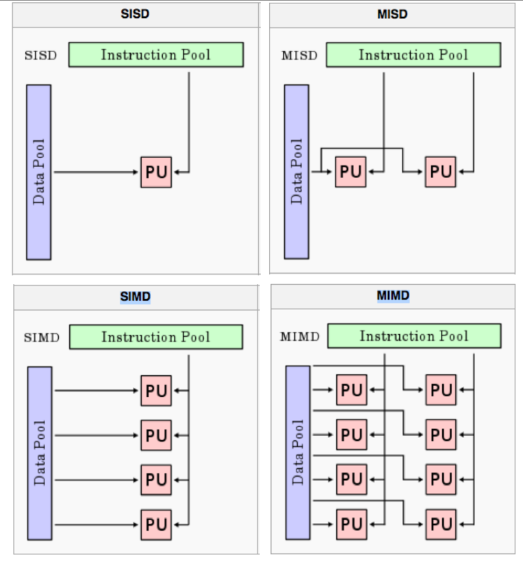
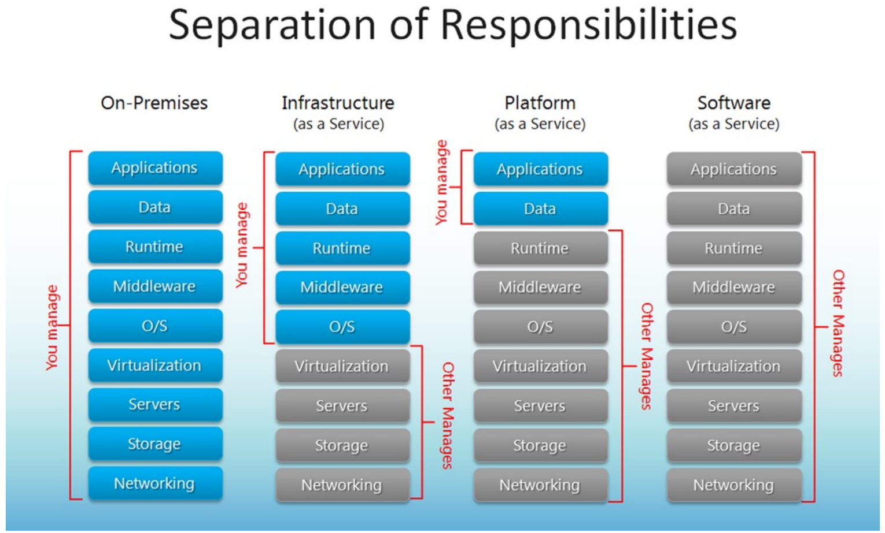

# CCC final

## Week 1

### Cloud computing

- Definition
  - Cloud computing is a synonym for distributed computing over a network and means the ability to run a program on many connected computers at the same time.
- Essential characteristics
  - **On-demand self-service**. A consumer can provision computing capabilities as needed without requiring human interaction with each service provider.
  - **Networked access**. Capabilities are available over the network and accessed through standard mechanisms that promote use by heterogeneous client platforms.
  - **Resource pooling**. The provider's computing resources are pooled to serve multiple consumers using a multi-tenant model potentially with different physical and virtual resources that can be dynamically assigned and reassigned according to consumer demand.
  - **Rapid elasticity**. Capabilities can be elastically provisioned and released, in some cases automatically, to scale rapidly upon demand.
  - **Measured service**. Cloud systems automatically control and optimize resource use by leveraging a metering capability at some level of abstraction appropriate to the type of service.
- Flavours
  - Computer clouds 计算机云: Amazon、Azure
  - Data clouds 数据云：Amazon、Google docs、iCloud、Dropbox
  - Application clouds 应用程序云：App store, Virtual image factories, Community-specific
  - Private, Public, Hybrid, Mobile, health, … clouds
- Pros
  - avoid upfront infrastructure costs
  - focus on projects that differentiate their businesses instead of on infrastructure
  - get their applications up and running faster, with improved manageability and less maintenance
  - enables IT to more rapidly adjust resources to meet fluctuating and unpredictable business demand.
  - Cloud providers typically use a "pay as you go" model.
- Cons
  - unexpectedly high charges if administrators do not adapt to the cloud pricing model

### Distributed System

#### Key distributed systems focus mid-90s

- Transparency and heterogeneity of computer-computer interactions
- finding/discovering resources (trader!),
- binding to resources in real time, 
- run time type checking, 
- invoking resources
- dealing with heterogeneity of systems
  - applications and operating systems
- focused on computer-computer interaction

#### Challenges of earlier distributed system implementations

- Complexity of implementations: Middleware bloat and lock-in, Vision and challenges of reality
- Vendor specific solutions: Less mature standards
- Scale of the problem area: Telecoms, banking, The growth (boom!) of the web

### Grid computing

From computer-computer focus to organisation-organisation focus

#### Grid technology

- Globus Toolkit Project: GT2 - Complex software system for large, scale distributed software systems development
- Move to service-based approach: GT3 - core technologies refactored as “Grid Services”
- Complete reassessment of OGSI approach to be “purer” web services: GT4 - Web service resource framework (WSRF)

#### How hard can a compute Grid be

- Information Systems:What resources are available. Servers, CPUs, memory, storage, queues,OS, applications, databases
- Monitoring and Discovery Systems: What is the status of those resources
- Job scheduling/resource brokering: Fastest, most secure/reliable, cheapest
- Virtual organisation support: Security, Public Key Infrastructures

## Week 2

## Week 3 parallelization

### Compute Scaling

- Vertical Computational Scaling
  - Have faster processors
    - n GHz CPU → 2n GHz ⇒ 2x faster
    - Easy to do, but costs more
  - Limits of fundamental physics/matter

- Horizontal Computational Scaling
  - Have more processors
    - Easy to add more; cost increase not so great
    - Harder to design, develop, test, debug, deploy, manage, understand
    - Transistor count still rising
    - Clock speed flattening sharply
  - High Throughput Computer (HTC) far more important than HPC

### Add "More" Options

- Single machine multiple cores
  - Typical laptop/PC/server these days
- Loosely coupled collection/cluster of machines
  - Pooling/sharing of resources
    - Dedicated vs available only when not in use by others
    - Web services, ... Condor, Seti@home, Boinc
- Tightly coupled cluster of machines
  - Typical HPC/HTC set-up (SPARTAN, NCI, …)
    - Many servers in same rack/server room (often with fast message passing interconnects)
- Widely distributed clusters of machines
  - UK NGS, EGEE, … distributed systems more generally
- Hybrid combinations of the above
  - Leads to many challenges with distributed systems
    - Shared state (or lack thereof)
    - Message passing paradigms   - dangers of delayed/lost messages

### Limitations

T(1) time for serial computation  
T(N) time for N parallel computations  
S(N) speed up  
Proportion of speed up depends on parts of program that cannot be parallelized  

#### Amdahl’s Law

$\alpha$ the proportion of the program that cannot be parallelized and must be executed sequentially(非并行运算中不可并行的时间占比)

$T(1) = F(不可并行部分) + P(可并行部分)$, $T(N) = F + P/N$  

$S = \frac{T(1)}{T(N)}=\frac{F + P}{F + P/N}=\frac{1+P/F}{1+P/NF}$  

$P/F = \frac{1-\alpha}{\alpha}$  

$S = \frac{1+\frac{1-\alpha}{\alpha}}{1+\frac{1-\alpha}{N\alpha}}=\frac{1}{\alpha+\frac{1-\alpha}{N}}=\frac{1}{\alpha}$  

**Limitation**: 1) each processor has to deal with loop overheads such as calculation of bounds, 2) test for loop completion 3) loop overhead acts as a further (serial) overhead in running the code. 4) Also getting data to/from many processor overheads.  
Amdahl’s law assumes a fixed problem size. It cannot predict length of time required for some jobs.  

#### Gustafson’s Law （scaled speed-up)

Gustafson’s law proposes that programmers tend to set the size of problems to fully exploit the computing power that becomes available as the resources improve. Therefore, if faster equipment is available, larger problems can be solved within the same time. The law redefines efficiency, due to the possibility that limitations imposed by the sequential part of a program may be countered by increasing the total amount of computation.

$\alpha$ 并行运算中不可并行的时间占比

$T(1) = F(不可并行部分) + Np(可并行部分)$, $T(N) = F + p$  

$S = \frac{T(1)}{T(N)}=\frac{F + Np}{F + p}=\frac{F}{F+p}+\frac{Np}{F+p}$  

$p/F = \frac{1-\alpha}{\alpha}$ (单个进程中的可并行部分时间和不可并行的时间之比)  

$S = \alpha+N(1-\alpha)=N-\alpha(N-1)$  

(Amdahl's law: 给定的任务给无穷多的资源也不能让运行时间少于某一值，Gustafson's Law: 数据规模加大n倍, 处理器加n倍，并行的时间一样)

### Computer Architecture

- CPU for executing programs
  - ALU, FPU, . . .
  - Load / store unit
  - Registers (fast memory locations)
  - Program counter (address of instruction that is executing)
  - Memory interface
- Memory that sores / executes programs and related data
- I/O systems (keyboards, networks)
- Permanent storage for reading / writing data in / out of memory
- The balance of all of these are of key importance (especially for HPC systems)
  - Superfast CPUs starved of data
- There are many ways to design / architect computers
  - Different flavors suitable to different problem

### Flynn’s Taxonomy

#### Single Instruction, Single Data stream (SISD)

- Sequential computer which exploits no parallelism in either the instruction or data streams
- Single control unit (CU/CPU) fetches single Instruction Stream from memory. The CU/CPU then generates appropriate control signals to direct single processing element to operate on single Data Stream, i.e., one operation at a time.
- Pretty much obsolete...!
  - Basic idea of von Neumann computer

#### Single Instruction, Multiple Data streams (SIMD)

- Multiple processing elements that perform the same operation on multiple data points simultaneously
- Focus is on data level parallelism, i.e., many parallel computations, but only a single process (instruction) at a given moment
- Many modern computers use SIMD instructions, e.g., to improve performance of multimedia use such as for image processing

#### Multiple Instruction, Single Data stream (MISD)

- Parallel computing architecture where many functional units (PU/CPU) perform different operations on the same data
- Examples include fault tolerant computer architectures, e.g., running multiple error checking processes on same data stream

#### Multiple Instruction, Multiple Data streams (MIMD)

- number of processors that function asynchronously and independently
- at any time, different processors may be executing different instructions on different pieces of data
- machines can be shared memory or distributed memory categories 
  - depends on how MIMD processors access memory
- Most systems these days operate on MIMD

### Approaches for Parallelism

#### Explicit vs Implicit parallelism

- Implicit Parallelism
  - Supported by parallel languages and parallelizing compilers that take care of identifying parallelism, the scheduling of calculations and the placement of data (Pretty hard to do)
- Explicit Parallelism
  - In this approach, the programmer is responsible for most of the parallelization effort such as task decomposition, mapping tasks to processors, inter-process communications
  - This approach assumes user is the best judge of how parallelism can be exploited for a particular application (Typically non-trivial to achieve!)
  - Consider SPARTAN HPC cluster assignment

#### Hardware Parallelisation

- Hardware Threading CPU
  - Cache - much faster than reading / writing to main memory; instruction cache, data cache (multi-level) andtranslation lookaside buffer used for virtual-physical address translation Parallelization by adding extra CPU to allow more instructions to be processed per cycle. Usually shares arithmetic units. Heavy use of one type of computation can tie up all the available units of the CPU preventing other threads from using them.
- Multi-Core
  - Multiple cores that can process data and perform computational tasks in parallel. Typically share same cache,but issue of cache read / write performance and cache coherence. Possibility of cache stalls (CPU not doing anything whilst waiting for caching), many chips have mixture (L1 cache on single cores; L2 cache on pairs ofcores; L3 cache shared by all cores); typical to have different cache speeds and cache sizes (higher hit rates but potentially higher latency).
- Symmetric Multiprocessing (SMP)
  - Two or more identical processors connected to a single, shared main memory, with full access to all I/O devices, controlled by a single OS instance that treats all processors equally. Each processor executes differentprograms and works on different data but with capability of sharing common resources (memory, I/O devices, . . .). Processors can be connected in a variety of way: buses, crossbar switches, meshes. More complex toprogram since need to program both for CPU and inter-processor communication (bus).
- Non-Uniform Memory Access (NUMA)
  - Non-uniform memory access provides speed-up by allowing a processor to access its own local memory faster than non-local memory. Improved performance as long as data are localized to specific processes / processors. Key is allocating memory / processors in NUMA friendly ways, e.g. to avoid scheduling / locking and (expensive) inter-processor communication.

#### Operating System

- Most modern multi-core operating systems support different “forms” of parallelization
  - Parallel vs Interleaved semantics
- Compute parallelism
  - Processes
    - Used to realize tasks, structure activities
  - Threads
  - Native threads: Fork, Spawn, Join
  - Green threads: Scheduled by a virtual machine instead of natively by the OS
- Data parallelism
  - Caching (cache coherency)
  - OS implies on “a” computer

#### Software/Applications

- Many (most!) languages now support a range of parallelisation/concurrency features
  - Threads, thread pools, locks, semaphores, …
- Many languages developed specifically for parallel/concurrent systems
- Key issues that need to be tackled
  - Deadlock   - processes involved constantly waiting for each other
  - Livelock   - processes involved in livelock constantly change with regard to one another, but none are progressing

### Message Passing Interface

- widely adopted approach for message passing in parallel systems
- mappings to major languages C, C++, Python, Java
- support point-point, broadcast communications
- key MPI functions
  1. MPI_Init initiate MPI computation
  2. MPI_Finalize terminate computation
  3. MPI_Comm_size determine number of processors
  4. MPI_Comm_rank determine my process identifier
  5. MPI_Send send a message
  6. MPI_Recv receive a message

### Data Parallelism Approaches

- Challenges of big data
  - The most important kind of parallelism challenge?
- Distributed data
  - Consistency, Availability, Partition tolerance
    - CAP Theorem   - more later
  - ACID <-> BASE
- Distributed File Systems
  - e.g. Hadoop, Lustre, Ceph…

### Erroneous Assumptions of Distributed Systems

1. The network is reliable
2. Latency is zero
3. Bandwidth is infinite
4. The network is secure
5. Topology doesn't change
6. There is one administrator
7. Transport cost is zero
8. The network is homogeneous
9. Time is ubiquitous

### Parallelization

#### Master Worker/Slave Model

- Master decomposes the problem into small tasks, distributes to workers and gathers partial results to produce the final result. (Master 将问题分割为小的任务，然后分发给每个 slave，再总结每个 worker 的结果。)
- Realized in many ways of different levels of granularity, e.g. threads through to web service workflow definition and enactment. (以多种方式实现不同级别的粒度（例如）遍历 Web 服务工作流的定义和制定)

#### Single-Program Multiple-Data

- Commonly exploited model
  - Bioinformatics, MapReduce
- Each process executes the same piece of code, but on different parts of the data(同样的代码处理不同的数据)
- Data is typically split among the available processors(数据分割)
- Data splitting and analysis can be done in many ways

#### Data pipelining

- Suitable for applications involving multiple stages of execution, that typically operate on large number of data sets.

#### Divide and Conquer

- A problem is divided into two or more sub problems, and each of these sub problems are solved independently, and their results are combined
- 3 operations: split, compute and join
- Master-worker / task-farming is like divide and conquer with master doing both split and join operation

#### Speculative Parallelism

- Used when it is quite difficult to achieve parallelism through the previous paradigms
- Problems with complex dependencies - use “look ahead” execution
- Consider a (long running) producer P and a consumer C such that C depends on P for the value of some variable V. If the value of V is predictable, we can execute C speculatively using a predicted value in parallel with P. (用预测的结果先进行下一步运算)
  - If the prediction turns out to be correct, we gain performance since C does not wait for P anymore.
  - If the prediction is incorrect (which we can find out when P completes), we have to take corrective action, cancel C and restart C with the right value of V again.

## Week 4

High­performance computing (HPC) is any computer system whose architecture allows for above average performance. A system that is one of the most powerful in the world, but is poorly designed, could be a "supercomputer".

Clustered computing is when two or more computers serve a single resource. This improves performance and provides redundancy; typically a collection of smaller computers strapped together with a high­speed local network

### Linux advantage

The operating system and many applications are provided as "free and open source", which means that not only are there are some financial savings, were also much better placed to improve, optimize and maintain specific programs. Free or open source software (not always the same thing) can be can be compiled from source for the specific hardware and operating system configuration, and can be optimised according to compiler flags. There is necessary where every clock cycle is important.

### Module command

- module help帮助
- module avail可用组件
- module whatis $<modulefile>$组件详情
- module display $<modulefile>$组件具体会对你的电脑干啥
- module load/unload $<modulefile>$加载删除组件
- module switch $<modulefile1> <modulefile2>$替换组件
- module purge移除所有组件

### Slurm

User Commands | SLURM
---- | ----
Job submission| sbatch [script_file]
Job submission| scancel [job_id]
Job status (by job)| squeue [job_id]
Job status (by user)| squeue -u [user_name]
Node list| sinfo -N
Queue list| squeue
Cluster status| squeue -p [partition]
Queue | -p [queue]
Job Name | --job-name=[name]
Nodes | -N [min[-max]]
CPU Count | -n [count]
Wall Clock Limit | -t [days-hh:mm:ss]
Event Address | --mail-user=[address]
Event Notification | --mail-type=[events]
Memory Size | --mem=[mem][M|G|T]
Proc Memory Size | --mem-per-cpu=[mem][M|G|T]

#### Slurm sample

#! /bin/bash#SBATH - -partition=cloud 指定执行任务的分区  
#SBATH - -time=01:00:00 指定等待时间  
#SBATH - -nodes=2 指定使用 node 的数量  
#SBATH - -ntasks-per-node=4 指定每个 node 执行几个任务  
#SBATH - -cpus-per-task=1 指定每个任务使用几个 CPU  
module load foss/2019b 指定运行环境  
module load python/3.7.4 指定运行环境  
mpirun -np 8 python HappyCity1.py 使用 mpi 并行运行代码文件  

### 5. MPI4py

- MPI_Status(): It is not a routine, but rather a data structure and is typically attached to an MPI_Recv() routine.
- MPI_Request(): A wrapper for MPI Requests such as wait, waitany, waitall, waitsome, start, cancel, startmall.
- MPI_Barrier(): Enforces synchronization between MPI processes in a group by placing a barrier on communication between groups. An MPI barrier completes after all group members have entered the barrier.
- MPI_Wtime(): Returns an elapsed time as a floating-point number of seconds on the calling processor from an arbitrary time in the past.
- MPI_Bcast Broadcasts a message from the process with rank "root" to all other processes of the communicator, including itself. It is significantly more preferable than using a loop.
- MPI_Scatter(): Sends data from one task to all tasks in a group; the inverse operation of MPI_Gather(). The outcome is as if the root executed N send operations and each process executed a receive.
- MPI_Reduce performs a reduce operation (such as sum, max, logical AND, etc.) across all the members of a communication group.
- MPI_Allreduce conducts the same operation but returns the reduced result to all processors
- MPI_Init: initiate MPI computation
- MPI_Finalize: terminate computation
- MPI_COMM_SIZE: determine number of processors
- MPI_COMM_RANK: determine my process identifier
- MPI_SEND: send a message
- MPI_RECV: receive a message

### Limitations of Parallel Computation

- Parallel programming and multicore systems should mean better performance. This can be expressed a ratio called speedup.
  - Speedup (p) = Time (serial) / Time (parallel)
- Correctness in parallelisation requires synchronisation. Synchronisation and atomic operations causes loss of performance, communication latency.
- Amdahl's law, establishes the maximum improvement to a system when only part of the system has been improved.

## Week 5 Cloud and Automation

Cloud computing is a model for enabling ubiquitous, convenient, on-demand network access to a shared pool of configurable computing resources (e.g., networks, servers, storage, applications, and services) that can be rapidly provisioned and released with minimal management effort or service provider interaction.

### Cloud Models

- Deployment models: 1) private 2) community 3) public 4) hybrid
- Delivery models:
  - Software as a service (SaaS)
  - Platform as a service (PaaS)
  - Infrastructure as a service (IaaS)
- Essential Characteristics: (Cloud computing)
  - On-demand self-service
  - Broad network access
  - Resource pooling
  - Rapid elasticity
  - Measured service

### Deployment Models

#### Public Clouds

- Pros
  - Utility computing
  - Can focus on core business
  - Cost-effective
  - “Right-sizing”
  - Democratisation of computing
- Cons
  - Security
  - Loss of control
  - Possible lock-in
  - Dependency of Cloud provider continued existence

#### Private Clouds

- Pros
  - Control
  - Consolidation of resources
  - Easier to secure
  - More trust
- Cons
  - Relevance to core business? Netflix to Amazon
  - Staff/management overheads
  - Hardware obsolescence
  - Over/under utilisation challenges

#### Hybrid Clouds

- Examples: Eucalyptus, VMWare vCloud Hybrid Service
- Pros
  - Cloud-bursting: Use private cloud, but burst into public cloud when needed
- Cons
  - How do you move data/resources when needed?
  - How to decide (in real time?) what data can go to public cloud?
  - Is the public cloud compliant with PCI-DSS (Payment Card Industry   - Data Security Standard)?

### XaaS

- IaaS
  - AWS
  - Azure
  - Alibaba Cloud
- PaaS
  - Google App Engine
  - Heroku
  - OpenShift
- SaaS
  - Gmail
  - Salesforce
  - Microsoft Office 365

### Terms

**Machine Image**: a stored image / template from which a new virtual machine can be launched  

**Instance**: a running virtual machine based on some machine image  

**Volume**: attachable Block Storage, which is the equivalent of a virtual disk drive  

**Object Storage**: a large store for storing simple binary objects + metadata within containers  

**Security groups**: a means of specifying firewall rules  

**Key-pairs**: public / private key pairs for accessing virtual machine  

### Automation

- Deploying complex cloud systems requires a lot of moving parts
  - Easy to forget what software you installed, and what steps you took to configure the system
  - Error-prone, can be non-repeatable
  - Snapshots are monolithic - provide no record of what has changed
- Automation
  - Provides a record of what you did
  - Codifies knowledge about the system
  - Makes process repeatable
  - Makes it programmable - “Infrastructure as Code”

#### Classification of Scripting tools

- Cloud-focused
  - Boto, CloudFormation, Heat
- Shell scripts
  - Bash, Perl
- Configuration Management
  - Configuration management refers to the process of systematically handling changes to a system in a way that it maintains integrity over time.
  - Automation is the mechanism used to make servers reach a desirable state, previously defined by provisioning scripts using tool-specific languages and features.
  - Puppet, Ansible

### Ansible

- An automation tool for configuring and managing
computers. Finer grained set up and configuration of software
packages
- Combines multi-node software deployment
- Ad-hoc task execution and configuration management

#### Ansible Features

- Easy to learn
  - Playbooks in **YAML**, Templates in **Jinja2**, Inventory in **ini** file
  - Sequential execution
- Minimal requirements
  - No need for centralized management servers / daemons
  - Single command to install pip install ansible
  - Uses SSH to connect to target machine
- Idempotent (repeatable)
  - Executing N times no different to executing once
  - Prevents side-effects from re-running scripts
- Extensible
  - Write your own modules
- Supports push or pull
  - Push by default but can use cron job to make it pull
- Rolling updates
  - Useful for continuous deployment / zero downtime deployment
- Inventory management
  - Dynamic inventory from external data sources
  - Execute tasks against host patterns
- Ansible Vault for encrypted data
- Ad-hoc commands
  - When you need to execute a one-off command against your inventory
  - ansible -i hosts -u ubuntu -m shell "reboot"

#### YAML

- Ansible playbooks are expressed in YAML.
  - YAML: YAML Ain’t Markup Language
  - YAML is a human friendly data serialization standard for all programming languages.
- Ansible uses Jinja2 templating for dynamic expression
  - Jinja2 is a modern and designer-friendly templating language for Python, modelled after Django’s templates.

## Week 6 Service-oriented Architectures

## Week 7

## Week 8

## Week 9

## Week 10

## Week 11
