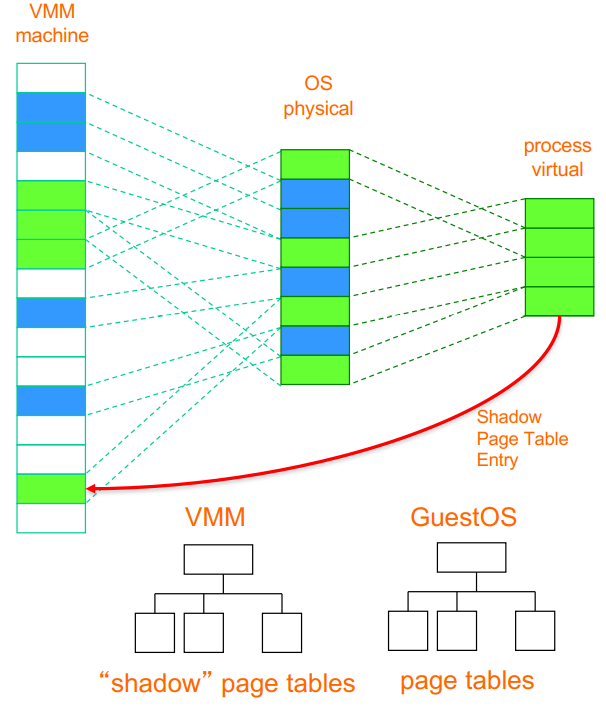

# CCC final

## Week 1

### Cloud computing

- Definition
  - Cloud computing is a synonym for distributed computing over a network and means the ability to run a program on many connected computers at the same time.
- Essential characteristics
  - **On-demand self-service**. A consumer can provision computing capabilities as needed without requiring human interaction with each service provider.
  - **Networked access**. Capabilities are available over the network and accessed through standard mechanisms that promote use by heterogeneous client platforms.
  - **Resource pooling**. The provider's computing resources are pooled to serve multiple consumers using a multi-tenant model potentially with different physical and virtual resources that can be dynamically assigned and reassigned according to consumer demand.
  - **Rapid elasticity**. Capabilities can be elastically provisioned and released, in some cases automatically, to scale rapidly upon demand.
  - **Measured service**. Cloud systems automatically control and optimize resource use by leveraging a metering capability at some level of abstraction appropriate to the type of service.
- Flavours
  - Computer clouds 计算机云: Amazon、Azure
  - Data clouds 数据云：Amazon、Google docs、iCloud、Dropbox
  - Application clouds 应用程序云：App store, Virtual image factories, Community-specific
  - Private, Public, Hybrid, Mobile, health, … clouds
- Pros
  - avoid upfront infrastructure costs
  - focus on projects that differentiate their businesses instead of on infrastructure
  - get their applications up and running faster, with improved manageability and less maintenance
  - enables IT to more rapidly adjust resources to meet fluctuating and unpredictable business demand.
  - Cloud providers typically use a "pay as you go" model.
- Cons
  - unexpectedly high charges if administrators do not adapt to the cloud pricing model

### Distributed System

#### Key distributed systems focus mid-90s

- Transparency and heterogeneity of computer-computer interactions
- finding/discovering resources (trader!)
- binding to resources in real time
- run time type checking
- invoking resources
- dealing with heterogeneity of systems
  - applications and operating systems
- focused on computer-computer interaction

#### Challenges of earlier distributed system implementations

- Complexity of implementations: Middleware bloat and lock-in, Vision and challenges of reality
- Vendor specific solutions: Less mature standards
- Scale of the problem area: Telecoms, banking, The growth (boom!) of the web

### Grid computing

From computer-computer focus to organisation-organisation focus

#### Grid technology

- Globus Toolkit Project: GT2 - Complex software system for large, scale distributed software systems development
- Move to service-based approach: GT3 - core technologies refactored as “Grid Services”
- Complete reassessment of OGSI approach to be “purer” web services: GT4 - Web service resource framework (WSRF)

#### How hard can a compute Grid be

- Information Systems:What resources are available. Servers, CPUs, memory, storage, queues,OS, applications, databases
- Monitoring and Discovery Systems: What is the status of those resources
- Job scheduling/resource brokering: Fastest, most secure/reliable, cheapest
- Virtual organisation support: Security, Public Key Infrastructures

## Week 3 parallelization

### Compute Scaling

- Vertical Computational Scaling
  - Have faster processors
    - n GHz CPU → 2n GHz ⇒ 2x faster
    - Easy to do, but costs more
  - Limits of fundamental physics/matter

- Horizontal Computational Scaling
  - Have more processors
    - Easy to add more; cost increase not so great
    - Harder to design, develop, test, debug, deploy, manage, understand
    - Transistor count still rising
    - Clock speed flattening sharply
  - High Throughput Computer (HTC) far more important than HPC

### Add "More" Options

- Single machine multiple cores
  - Typical laptop/PC/server these days
- Loosely coupled collection/cluster of machines
  - Pooling/sharing of resources
    - Dedicated vs available only when not in use by others
    - Web services, ... Condor, Seti@home, Boinc
- Tightly coupled cluster of machines
  - Typical HPC/HTC set-up (SPARTAN, NCI, …)
    - Many servers in same rack/server room (often with fast message passing interconnects)
- Widely distributed clusters of machines
  - UK NGS, EGEE, … distributed systems more generally
- Hybrid combinations of the above
  - Leads to many challenges with distributed systems
    - Shared state (or lack thereof)
    - Message passing paradigms   - dangers of delayed/lost messages

### Limitations

T(1) time for serial computation  
T(N) time for N parallel computations  
S(N) speed up  
Proportion of speed up depends on parts of program that cannot be parallelized  

#### Amdahl’s Law

shows that the theoretical speedup of the execution of the whole task increases with the improvement of the resources of the system and that regardless of the magnitude of the improvement, the theoretical speedup is always limited by the part of the task that cannot benefit from the improvement.

$\alpha$ the proportion of the program that cannot be parallelized and must be executed sequentially(非并行运算中不可并行的时间占比)

$T(1) = F(不可并行部分) + P(可并行部分)$, $T(N) = F + P/N$  

$S = \frac{T(1)}{T(N)}=\frac{F + P}{F + P/N}=\frac{1+P/F}{1+P/NF}$  

$P/F = \frac{1-\alpha}{\alpha}$  

$S = \frac{1+\frac{1-\alpha}{\alpha}}{1+\frac{1-\alpha}{N\alpha}}=\frac{1}{\alpha+\frac{1-\alpha}{N}}=\frac{1}{\alpha}$  

**Limitation**: 1) each processor has to deal with loop overheads such as calculation of bounds, 2) test for loop completion 3) loop overhead acts as a further (serial) overhead in running the code. 4) Also getting data to/from many processor overheads.  
Amdahl’s law assumes a fixed problem size. It cannot predict length of time required for some jobs. amdahl's law 在实际使用中的问题Amdahl's law applies only to the cases where the problem size is fixed. In practice, as more computing resources become available, they tend to get used on larger problems (larger datasets), and the time spent in the parallelizable part often grows much faster than the inherently serial work. In this case, Gustafson's law gives a less pessimistic and more realistic assessment of the parallel performance

#### Gustafson’s Law （scaled speed-up)

Gustafson’s law proposes that programmers tend to set the size of problems to fully exploit the computing power that becomes available as the resources improve. Therefore, if faster equipment is available, larger problems can be solved within the same time. The law redefines efficiency, due to the possibility that limitations imposed by the sequential part of a program may be countered by increasing the total amount of computation.

$\alpha$ 并行运算中不可并行的时间占比

$T(1) = F(不可并行部分) + Np(可并行部分)$, $T(N) = F + p$  

$S = \frac{T(1)}{T(N)}=\frac{F + Np}{F + p}=\frac{F}{F+p}+\frac{Np}{F+p}$  

$p/F = \frac{1-\alpha}{\alpha}$ (单个进程中的可并行部分时间和不可并行的时间之比)  

$S = \alpha+N(1-\alpha)=N-\alpha(N-1)$  

(Amdahl's law: 给定的任务给无穷多的资源也不能让运行时间少于某一值，Gustafson's Law: 数据规模加大n倍, 处理器加n倍，并行的时间一样)

### Computer Architecture

- CPU for executing programs
  - ALU, FPU, . . .
  - Load / store unit
  - Registers (fast memory locations)
  - Program counter (address of instruction that is executing)
  - Memory interface
- Memory that sores / executes programs and related data
- I/O systems (keyboards, networks)
- Permanent storage for reading / writing data in / out of memory
- The balance of all of these are of key importance (especially for HPC systems)
  - Superfast CPUs starved of data
- There are many ways to design / architect computers
  - Different flavors suitable to different problem

### Flynn’s Taxonomy


#### Single Instruction, Single Data stream (SISD)

- Sequential computer which exploits no parallelism in either the instruction or data streams
- Single control unit (CU/CPU) fetches single Instruction Stream from memory. The CU/CPU then generates appropriate control signals to direct single processing element to operate on single Data Stream, i.e., one operation at a time.
- Pretty much obsolete...!
  - Basic idea of von Neumann computer

#### Single Instruction, Multiple Data streams (SIMD)

- Multiple processing elements that perform the same operation on multiple data points simultaneously
- Focus is on data level parallelism, i.e., many parallel computations, but only a single process (instruction) at a given moment
- Many modern computers use SIMD instructions, e.g., to improve performance of multimedia use such as for image processing

#### Multiple Instruction, Single Data stream (MISD)

- Parallel computing architecture where many functional units (PU/CPU) perform different operations on the same data
- Examples include fault tolerant computer architectures, e.g., running multiple error checking processes on same data stream

#### Multiple Instruction, Multiple Data streams (MIMD)

- number of processors that function asynchronously and independently
- at any time, different processors may be executing different instructions on different pieces of data
- machines can be shared memory or distributed memory categories
  - depends on how MIMD processors access memory
- Most systems these days operate on MIMD

### Approaches for Parallelism

#### Explicit vs Implicit parallelism

- Implicit Parallelism
  - Supported by parallel languages and parallelizing compilers that take care of identifying parallelism, the scheduling of calculations and the placement of data (Pretty hard to do)
- Explicit Parallelism
  - In this approach, the programmer is responsible for most of the parallelization effort such as task decomposition, mapping tasks to processors, inter-process communications
  - This approach assumes user is the best judge of how parallelism can be exploited for a particular application (Typically non-trivial to achieve!)
  - Consider SPARTAN HPC cluster assignment

#### Hardware Parallelisation

- Hardware Threading CPU
  - Cache - much faster than reading / writing to main memory; instruction cache, data cache (multi-level) andtranslation lookaside buffer used for virtual-physical address translation Parallelization by adding extra CPU to allow more instructions to be processed per cycle. Usually shares arithmetic units. Heavy use of one type of computation can tie up all the available units of the CPU preventing other threads from using them.
- Multi-Core
  - Multiple cores that can process data and perform computational tasks in parallel. Typically share same cache,but issue of cache read / write performance and cache coherence. Possibility of cache stalls (CPU not doing anything whilst waiting for caching), many chips have mixture (L1 cache on single cores; L2 cache on pairs ofcores; L3 cache shared by all cores); typical to have different cache speeds and cache sizes (higher hit rates but potentially higher latency).
- Symmetric Multiprocessing (SMP)
  - Two or more identical processors connected to a single, shared main memory, with full access to all I/O devices, controlled by a single OS instance that treats all processors equally. Each processor executes differentprograms and works on different data but with capability of sharing common resources (memory, I/O devices, . . .). Processors can be connected in a variety of way: buses, crossbar switches, meshes. More complex toprogram since need to program both for CPU and inter-processor communication (bus).
- Non-Uniform Memory Access (NUMA)
  - Non-uniform memory access provides speed-up by allowing a processor to access its own local memory faster than non-local memory. Improved performance as long as data are localized to specific processes / processors. Key is allocating memory / processors in NUMA friendly ways, e.g. to avoid scheduling / locking and (expensive) inter-processor communication.

#### Operating System

- Most modern multi-core operating systems support different “forms” of parallelization
  - Parallel vs Interleaved semantics
- Compute parallelism
  - Processes
    - Used to realize tasks, structure activities
  - Threads
  - Native threads: Fork, Spawn, Join
  - Green threads: Scheduled by a virtual machine instead of natively by the OS
- Data parallelism
  - Caching (cache coherency)
  - OS implies on “a” computer

#### Software/Applications

- Many (most!) languages now support a range of parallelisation/concurrency features
  - Threads, thread pools, locks, semaphores, …
- Many languages developed specifically for parallel/concurrent systems
- Key issues that need to be tackled
  - Deadlock   - processes involved constantly waiting for each other
  - Livelock   - processes involved in livelock constantly change with regard to one another, but none are progressing

### Message Passing Interface

- widely adopted approach for message passing in parallel systems
- mappings to major languages C, C++, Python, Java
- support point-point, broadcast communications
- key MPI functions
  1. MPI_Init initiate MPI computation
  2. MPI_Finalize terminate computation
  3. MPI_Comm_size determine number of processors
  4. MPI_Comm_rank determine my process identifier
  5. MPI_Send send a message
  6. MPI_Recv receive a message

### Data Parallelism Approaches

- Challenges of big data
  - The most important kind of parallelism challenge?
- Distributed data
  - Consistency, Availability, Partition tolerance
    - CAP Theorem   - more later
  - ACID <-> BASE
- Distributed File Systems
  - e.g. Hadoop, Lustre, Ceph…

### Erroneous Assumptions of Distributed Systems

1. The network is reliable
2. Latency is zero
3. Bandwidth is infinite
4. The network is secure
5. Topology doesn't change
6. There is one administrator
7. Transport cost is zero
8. The network is homogeneous
9. Time is ubiquitous

### Parallelization

#### Master Worker/Slave Model

- Master decomposes the problem into small tasks, distributes to workers and gathers partial results to produce the final result. (Master 将问题分割为小的任务，然后分发给每个 slave，再总结每个 worker 的结果。)
- Realized in many ways of different levels of granularity, e.g. threads through to web service workflow definition and enactment. (以多种方式实现不同级别的粒度（例如）遍历 Web 服务工作流的定义和制定)

#### Single-Program Multiple-Data

- Commonly exploited model
  - Bioinformatics, MapReduce
- Each process executes the same piece of code, but on different parts of the data(同样的代码处理不同的数据)
- Data is typically split among the available processors(数据分割)
- Data splitting and analysis can be done in many ways

#### Data pipelining

- Suitable for applications involving multiple stages of execution, that typically operate on large number of data sets.

#### Divide and Conquer

- A problem is divided into two or more sub problems, and each of these sub problems are solved independently, and their results are combined
- 3 operations: split, compute and join
- Master-worker / task-farming is like divide and conquer with master doing both split and join operation

#### Speculative Parallelism

- Used when it is quite difficult to achieve parallelism through the previous paradigms
- Problems with complex dependencies - use “look ahead” execution
- Consider a (long running) producer P and a consumer C such that C depends on P for the value of some variable V. If the value of V is predictable, we can execute C speculatively using a predicted value in parallel with P. (用预测的结果先进行下一步运算)
  - If the prediction turns out to be correct, we gain performance since C does not wait for P anymore.
  - If the prediction is incorrect (which we can find out when P completes), we have to take corrective action, cancel C and restart C with the right value of V again.

## Week 4

**High­performance computing** (HPC) is any computer system whose architecture allows for above average performance. A system that is one of the most powerful in the world, but is poorly designed, could be a "supercomputer".

**Clustered computing** is when two or more computers serve a single resource. This improves performance and provides redundancy; typically a collection of smaller computers strapped together with a high­speed local network

### Linux advantage

The operating system and many applications are provided as "free and open source", which means that not only are there are some financial savings, were also much better placed to improve, optimize and maintain specific programs. Free or open source software (not always the same thing) can be can be compiled from source for the specific hardware and operating system configuration, and can be optimised according to compiler flags. There is necessary where every clock cycle is important.

### Module command

- module help帮助
- module avail可用组件
- module whatis $<modulefile>$组件详情
- module display $<modulefile>$组件具体会对你的电脑干啥
- module load/unload $<modulefile>$加载删除组件
- module switch $<modulefile1> <modulefile2>$替换组件
- module purge移除所有组件

### Slurm

User Commands | SLURM
---- | ----
Job submission| sbatch [script_file]
Job submission| scancel [job_id]
Job status (by job)| squeue [job_id]
Job status (by user)| squeue -u [user_name]
Node list| sinfo -N
Queue list| squeue
Cluster status| squeue -p [partition]
Queue | -p [queue]
Job Name | --job-name=[name]
Nodes | -N [min[-max]]
CPU Count | -n [count]
Wall Clock Limit | -t [days-hh:mm:ss]
Event Address | --mail-user=[address]
Event Notification | --mail-type=[events]
Memory Size | --mem=[mem][M|G|T]
Proc Memory Size | --mem-per-cpu=[mem][M|G|T]

#### Slurm sample

#! /bin/bash#SBATH - -partition=cloud 指定执行任务的分区  
#SBATH - -time=01:00:00 指定等待时间  
#SBATH - -nodes=2 指定使用 node 的数量  
#SBATH - -ntasks-per-node=4 指定每个 node 执行几个任务  
#SBATH - -cpus-per-task=1 指定每个任务使用几个 CPU  
module load foss/2019b 指定运行环境  
module load python/3.7.4 指定运行环境  
mpirun -np 8 python HappyCity1.py 使用 mpi 并行运行代码文件  

### 5. MPI4py

- MPI_Status(): It is not a routine, but rather a data structure and is typically attached to an MPI_Recv() routine.
- MPI_Request(): A wrapper for MPI Requests such as wait, waitany, waitall, waitsome, start, cancel, startmall.
- MPI_Barrier(): Enforces synchronization between MPI processes in a group by placing a barrier on communication between groups. An MPI barrier completes after all group members have entered the barrier.
- MPI_Wtime(): Returns an elapsed time as a floating-point number of seconds on the calling processor from an arbitrary time in the past.
- MPI_Bcast Broadcasts a message from the process with rank "root" to all other processes of the communicator, including itself. It is significantly more preferable than using a loop.
- MPI_Scatter(): Sends data from one task to all tasks in a group; the inverse operation of MPI_Gather(). The outcome is as if the root executed N send operations and each process executed a receive.
- MPI_Reduce performs a reduce operation (such as sum, max, logical AND, etc.) across all the members of a communication group.
- MPI_Allreduce conducts the same operation but returns the reduced result to all processors
- MPI_Init: initiate MPI computation
- MPI_Finalize: terminate computation
- MPI_COMM_SIZE: determine number of processors
- MPI_COMM_RANK: determine my process identifier
- MPI_SEND: send a message
- MPI_RECV: receive a message

### Limitations of Parallel Computation

- Parallel programming and multicore systems should mean better performance. This can be expressed a ratio called speedup.
  - Speedup (p) = Time (serial) / Time (parallel)
- Correctness in parallelisation requires synchronisation. Synchronisation and atomic operations causes loss of performance, communication latency.
- Amdahl's law, establishes the maximum improvement to a system when only part of the system has been improved.

## Week 5 Cloud and Automation

**Cloud computing** is a model for enabling ubiquitous, convenient, on-demand network access to a shared pool of configurable computing resources (e.g., networks, servers, storage, applications, and services) that can be rapidly provisioned and released with minimal management effort or service provider interaction.

### Cloud Models

- Deployment models: 1) private 2) community 3) public 4) hybrid
- Delivery models:
  - Software as a service (SaaS)
  - Platform as a service (PaaS)
  - Infrastructure as a service (IaaS)
- Essential Characteristics: (Cloud computing)
  - On-demand self-service
  - Broad network access
  - Resource pooling
  - Rapid elasticity
  - Measured service

### Deployment Models

#### Public Clouds

- Pros
  - Utility computing
  - Can focus on core business
  - Cost-effective
  - “Right-sizing”
  - Democratisation of computing
- Cons
  - Security
  - Loss of control
  - Possible lock-in
  - Dependency of Cloud provider continued existence

#### Private Clouds

- Pros
  - Control
  - Consolidation of resources
  - Easier to secure
  - More trust
- Cons
  - Relevance to core business? Netflix to Amazon
  - Staff/management overheads
  - Hardware obsolescence
  - Over/under utilisation challenges

#### Hybrid Clouds

- Examples: Eucalyptus, VMWare vCloud Hybrid Service
- Pros
  - Cloud-bursting: Use private cloud, but burst into public cloud when needed
- Cons
  - How do you move data/resources when needed?
  - How to decide (in real time?) what data can go to public cloud?
  - Is the public cloud compliant with PCI-DSS (Payment Card Industry   - Data Security Standard)?

### [XaaS](https://www.bmc.com/blogs/saas-vs-paas-vs-iaas-whats-the-difference-and-how-to-choose/)


- IaaS: a form of cloud computing that provides virtualized computing resources over the internet.
  - AWS
  - Azure
  - Alibaba Cloud
- PaaS: hardware and software tools available over the internet.
  - Google App Engine
  - Heroku
  - OpenShift
- SaaS: software that's available via a third-party over the internet.
  - Gmail
  - Salesforce
  - Microsoft Office 365

### Terms

**Machine Image**: a stored image / template from which a new virtual machine can be launched  

**Instance**: a running virtual machine based on some machine image  

**Volume**: attachable Block Storage, which is the equivalent of a virtual disk drive  

**Object Storage**: a large store for storing simple binary objects + metadata within containers  

**Security groups**: a means of specifying firewall rules  

**Key-pairs**: public / private key pairs for accessing virtual machine  

### Automation

- Deploying complex cloud systems requires a lot of moving parts
  - Easy to forget what software you installed, and what steps you took to configure the system
  - Error-prone, can be non-repeatable
  - Snapshots are monolithic - provide no record of what has changed
- Automation
  - Provides a record of what you did
  - Codifies knowledge about the system
  - Makes process repeatable
  - Makes it programmable - “Infrastructure as Code”

#### Classification of Scripting tools

- Cloud-focused
  - Boto, CloudFormation, Heat
- Shell scripts
  - Bash, Perl
- Configuration Management
  - Configuration management refers to the process of systematically handling changes to a system in a way that it maintains integrity over time.
  - Automation is the mechanism used to make servers reach a desirable state, previously defined by provisioning scripts using tool-specific languages and features.
  - Puppet, Ansible

### Ansible

- An automation tool for configuring and managing
computers. Finer grained set up and configuration of software
packages
- Combines multi-node software deployment
- Ad-hoc task execution and configuration management

#### Ansible Features

- Easy to learn
  - Playbooks in **YAML**, Templates in **Jinja2**, Inventory in **ini** file
  - Sequential execution
- Minimal requirements
  - No need for centralized management servers / daemons
  - Single command to install pip install ansible
  - Uses SSH to connect to target machine
- Idempotent (repeatable)
  - Executing N times no different to executing once
  - Prevents side-effects from re-running scripts
- Extensible
  - Write your own modules
- Supports push or pull
  - Push by default but can use cron job to make it pull
- Rolling updates
  - Useful for continuous deployment / zero downtime deployment
- Inventory management
  - Dynamic inventory from external data sources
  - Execute tasks against host patterns
- Ansible Vault for encrypted data
- Ad-hoc commands
  - When you need to execute a one-off command against your inventory
  - ansible -i hosts -u ubuntu -m shell "reboot"

#### YAML

- Ansible playbooks are expressed in YAML.
  - YAML: YAML Ain’t Markup Language
  - YAML is a human friendly data serialization standard for all programming languages.
- Ansible uses Jinja2 templating for dynamic expression
  - Jinja2 is a modern and designer-friendly templating language for Python, modelled after Django’s templates.

## Week 6 Service-oriented Architectures

### Abbreviation

- **SOA** Service-Oriented Architecture
- **ROA** Resource-Oriented Architecture
- **UML** Unified Modeling Language
- **SOAP** Simple Object Access Protocol
- **ReST** Representational State Transfer
- **RPC** Remote Procedure Call
- **WSDL** Web Services Description Language

### (system) architecture

- The way different software components are distributed on computers, and the way in which they interact with each other(系统架构就是不同软件组件在计算机上的分布方式以及它们彼此交互的方式)
- Architectures are often difficult to describe in words, hence diagrams are often used.(UML)
- A standard graphic way to describe architectures is through the Unified Modeling Language deployment diagram

#### Why Service-oriented Architectures(SOA)

- When an architecture is completely contained within the same machine, components can communicate directly, e.g. through function calls or object instantiations.
- However, when components are distributed such a direct approach typically cannot be used (e.g. Assignment 2!)
- Therefore, components (more properly, systems) have to interact in more loosely-coupled ways.
- Services are often used for this. Typically combinations and commonality of services can be used to form a Service-oriented Architecture (SoA).

#### SoA Core Goals

- A set of externally facing services that a business wants to provide to external collaborators
- An architectural pattern based on service providers, one or more brokers, and service requestors based on agreed service descriptions
- A set of architectural principles, patterns and criteria that support modularity, encapsulation, loose coupling, separation of concerns, reuse and composability
- A programming model complete with standards, tools and technologies that supports development and support of services (note that there can be many flavours of services)
- A middleware solution optimized for service assembly, orchestration, monitoring, and management, e.g. as workflows.

#### SoA Design Principles

- **Standardized service contract**: Services adhere to a communications agreement, as defined collectively by one or more service-description documents.
- **Service loose coupling**: Services maintain a relationship that minimizes dependencies and only requires that they maintain an awareness of each other.
- **Service abstraction**: Beyond descriptions in the service contract, services hide logic from the outside world.
- **Service reusability**: Logic is divided into services with the intention of promoting reuse.
- **Service autonomy**: Services have control over the logic they encapsulate.
- **Service statelessness**: Services minimize resource consumption by deferring the management of state information when necessary.
- **Service discoverability**: Services are supplemented with communicative meta data by which they can be effectively discovered and interpreted.
- **Service composability**: Services are effective composition participants, regardless of the size and complexity of the composition.
- **Service granularity**: a design consideration to provide optimal scope at the right granular level of the business functionality in a service operation.
- **Service normalization**: services are decomposed and/or consolidated to a level that minimizes redundancy, for performance optimization, access, and aggregation.
- **Service optimization**: high-quality services that serve specific functions are generally preferable to general purpose low-quality ones.
- **Service relevance**: functionality is presented at a level of granularity recognized by the user as a meaningful service.
- **Service encapsulation**: many services are consolidated for use under a SOA and their inner workings hidden.
- **Service location transparency**: the ability of a service consumer to invoke a service regardless of its actual location in the network.

#### SOAP/WS vs ReST

[difference of soap and rest](https://www.guru99.com/comparison-between-web-services.html)

Two patterns to call services over HTTP

- SOAP/WS is built upon the Remote Procedure Call paradigm
  - a language independent function call that spans another system
- ReST is centered around resources, and the way they can be manipulated (added, deleted, etc.) remotely
- Actually ReST is more of a style to use HTTP than a separate protocol
- SOAP/WS is a stack of protocols that covers every aspect of using a remote service, from service discovery, to service description, to the actual request/response
- ReST makes use of the different HTTP Methods (GET, POST, PUT, DELETE, etc)

### WSDL(Web Services Description Language)

- The Web Services Description Language (WSDL) is an XML-based interface description language that describes thefunctionality offered by a web service.
- WSDL provides a machine-readable description of how the service can be called, what parameters it expects, and what results/data structures it returns:
  - Definition   - what it does
  - Target Namespace   - context for naming things
  - Data Types   - simple/complex data structures inputs/outputs
  - Messages   - messages and structures exchanged between client and server
  - Port Type - encapsulate input/output messages into one logical operation
  - Bindings - bind the operation to the particular port type
  - Service - name given to the web service itself

### REST

"Representational State Transfer (ReST) is intended to evoke an image of how a well-designed Web application behaves: a network of web pages (a virtual state-machine), where the user progresses through an application by selecting links (state transitions), resulting in the next page (representing the next state of the application) being transferred to the user and rendered for their use."

1. Clients request Resource through Identifier (URL)
2. Server/proxy sends representation of Resource
3. This puts the client in a certain state.
4. Representation contains URLs allowing navigation.
5. Client follows URL to fetch another resource.
6. This transitions client into yet another state.

### Resource-Oriented Architecture(ROA)

- A ROA is a way of turning a problem into a RESTful web service: an arrangement of URIs, HTTP, and XML that works like the rest of the Web
- A resource is anything that’s important enough to be referenced as a thing in itself.
- If your users might
  - want to create a hypertext link to it
  - make or refute assertions about it
  - retrieve or cache a representation of it
  - include all or part of it by reference into another representation
  - annotate it
  - or perform other operations on it
- ...then you should make it a resource.

#### Mapping Actions to HTTP Method

ACTION | HTTP METHOD
----|----
Create Resource | PUT to a new URI, POST to an existing URI
Retrieve Resource | GET
Update Resource | POST to an existing URI
Delete Resource | DELETE

[PUT vs POST](https://restfulapi.net/rest-put-vs-post/)

- Common mistake: Always mapping PUT to Update and POST to create
- PUT should be used when target resource url is known by the client(idempotent)
- POST should be used when target resource URL is server generated.(not idempotent)
- When creating resources, we will use POST and PUT methods. If we know the URL of the resources, we will use POST method. But if we do not know the URL of the resources, we will use the PUT method to complete the task.
- When updating resources, the POST method will create a new record for the resource. However, the PUT method will overwrite the past record of the resource.

#### A Generic RoA Procedure

1. Figure out the data set
2. Split the data set into resources and for each kind of resource
3. Name the resources with URIs
4. Expose a subset of the uniform interface
5. Design the representation(s) accepted from the client
6. Design the representation(s) served to the client
7. Integrate this resource into existing resources, using hypermedia links and forms
8. Consider the typical course of events: what’s supposed to happen?
9. Consider error conditions: what might go wrong?

#### ReST Best Practices

1. Keep your URIs short   - and create URIs that don’t change.
2. URIs should be opaque identifiers that are meant to be
discovered by following hyperlinks, not constructed by the
client.
3. Use nouns, not verbs in URLs
4. Make all HTTP GETs side-effect free. Doing so makes the
request "safe".
5. Use links in your responses to requests! Doing so
connects your response with other data. It enables client
applications to be "self-propelled". That is, the response
itself contains info about "what's the next step to take".
Contrast this to responses that do not contain links. Thus,
the decision of "what's the next step to take" must be made
out-of-band.
6. Minimize the use of query strings.
7. Use HTTP status codes to convey errors/success
8. In general, keep the REST principles in mind
   - Addressability
   - Uniform Interface
   - Resources and Representations instead of Remote Procedure Call RPC
   - HATEOAS

Uniform Interface(统一端口)

- **Identification of Resources**: All important resources are identified by one (uniform) resource identifier mechanism (e.g. HTTP URL) 所有资源用统一的资源标识符
- **Manipulation of Resources through representations**: Each resource can have one or more representations. Such as application/xml, application/json, text/html, etc. Clients and servers negotiate to select representation. 通过表示层操作资源
- **Self-descriptive messages**: Requests and responses contain not only data but additional headers describing how the content should be handled. Such as if it should be cached, authentication requirements, etc. Access methods (actions) mean the same for all resources (universal semantics)自描述消息，请求和响应不仅仅包含数据，还包含描述应该如何处理内容的附加 header
- **HATEOAS**   - Hyper Media as the Engine of Application State
  - Resource representations contain links to identified resources 资源表示层包含了找到资源的
链接
  - Resources and state can be used by navigating links 资源根据导航来连接
    - links make interconnected resources navigable
    - without navigation, identifying new resources is service-specific
  - RESTful applications **navigate** instead of calling 导航而不是调用
    - representations contain information about possible traversals
    - application navigates to the next resource depending on link semantics
    - navigation can be delegated since all links use identifiers

Making Resources Navigable

- Essential for using Hypermedia Driven Application State
- RPC-oriented systems need to expose the available functions
  - functions are essential for interacting with a service
  - introspection or interface descriptions make functions discoverable
- ReSTful systems use a Uniform Interface
  - no need to learn about functions
  - but how to find resources?
    - find them by following links from other resources
    - learn about them by using URI Templates
    - understand them by recognizing representations

#### HTTP Methods

- HTTP methods can be **Safe, Idempotent, Neither**
- **Safe methods**: Do not change repeating a call is equivalent to not making a call at all.(多次和0次没区别)
- **Idempotent methods**: Effect of repeating a call is equivalent to making a single call(多次和1次没区别, 执行的结果和执行次数无关)
  - GET, OPTIONS, HEAD   - Safe
  - PUT, DELETE   - Idempotent
  - POST   - Neither safe nor idempotent

## Week 7 Big Data and CouchDB

### 4 "Vs"

- **Volume**: yes, volume (Giga, Tera, Peta, …) is a criteria, but not the only one
- **Velocity**: the frequency of new data is being brought into the system and analytics performed
- **Variety**: the variability and complexity of data schema. The more complex the data schema(s) you have, the higher the probability of them changing along the way, adding more complexity.
- **Veracity**: the level of trust in data accuracy (provenance); the more diverse sources you have, the more unstructured they are, the less veracity you have.

### Ad hoc Solution(为啥不用rdb而要用nosql)

- While Relational DBMSs are extremely good at ensuring consistency, they rely on normalized data models that, in a world of big data (think about Veracity and Variety) can no longer be taken for granted.
- Therefore, it makes sense to use DBMSs that are built upon data models that are not relational (relational model: tables, columns and relationships amongst tables -that is, relational algebra).
- While there is nothing preventing SQL to be used in distributed environments, alternative query languages have been used for distributed DBMSs, hence they are sometimes called NoSQL DBMSs

### DBMSs for Distributed Environments分为三类

- A key-value store is a DBMS that allows the retrieval of a chunk of data given a key: fast, but crude (e.g. Redis, RocksDB, Berkeley DB)
- A BigTable DBMS stores data in columns grouped into column families, with rows potentially containing different columns of the same family (e.g. Apache Cassandra, Apache Accumulo)
- A Document-oriented DBMS stores data as structured documents, usually expressed as XML or JSON (e.g. Apache CouchDB, MongoDB)

### A Tale of Two Clusters

- Distributed databases are run over “clusters”, that is, sets of connected computers
- Clusters are needed to:
  - Distribute the computing load over multiple computers to improve **availability**
  - Storing multiple copies of data to achieve **redundancy**
- Consider two document-oriented DBMSs (CouchDB and MongoDB) and their typical cluster architectures


#### CouchDB Cluster Architecture

- All nodes answer requests (read or write) at the same time
- Sharding (splitting of data across nodes) is done on every node
- When a node does not contain a document (say, a document of Shard A is requested to Node 2), the node requests it from another node (say, Node 1) and returns it to the client
- Nodes can be added/removed easily, and their shards are re-balanced automatically upon addition/deletion of nodes
- In this example there are 3 nodes, 4 shards and a replica number of 2

#### MongoDB Cluster Architecture

- Sharding (splitting of data) is done at the replica set level, hence it involves more than one cluster (a shard is on top of a replica set)
- Only the primary node in a replica set answers write requests, but read requests can (depending on the specifics of the configuration) be answered by every node (including secondary nodes) in the set
- Updates flow only from the primary to the secondary
- If a primary node fails, or discovers it is connected to a minority of nodes, a secondary of the same replica set is elected as the primary
- Arbiters (MongoDB instances without data) can assist in breaking a tie in elections.
- Data are balanced across replica sets
- Since a quorum has to be reached, it is better to have an odd number of voting members

### Brewer’s CAP Theorem

- CAP
  - **Consistency**: every client receiving an answer receives the same answer from all nodes in the cluster云中所有节点一致
  - **Availability**: every client receives an answer from any node in the cluster云中所有的节点都可以及时返回数据但是不能保证数据是最新且一致的
  - **Partition-tolerance**: the cluster keeps on operating when one or more nodes cannot communicate with the rest of the cluster如果单点被独立了还是能继续照常运行
- While the theorem shows all three qualities are symmetrical, Consistency and Availability are at odds only when a Partition happens
- “Hard” network partitions may be rare, but “soft” ones are not (a slow node may be considered dead even if it is not); ultimately, every partition is detected by a timeout
- Can have consequences that impact the cluster as a whole, e.g. a distributed join is only complete when all sub-queries return
- 传统数据库往往不会考虑到network partition因为所有数据都存在一个小的服务器上Traditional DBMS architectures were not concerned with network partitions, since all data were supposed to be in a small, co-located cluster of servers
- The emphasis on numerous commodity servers, can result in an increased number of hardware failures
- The CAP theorem forces us to consider trade-offs among different options

Database systems designed with traditional ACID guarantees in mind such as RDBMS choose consistency over availability, whereas systems designed around the BASE philosophy, common in the NoSQL movement for example, choose availability over consistency

#### Consistency and Availability: Two phase commit

This is the usual algorithm used in relational DBMS's (and MongoDB, to same extent), it enforces consistency by:

- locking data that are within the transaction scope
- performing transactions on write-ahead logs
- completing transactions (commit) only when all nodes in the cluster have performed the transaction
- aborts transactions (rollback) when a partition is detected
  - This procedure entails the following:
  - reduced availability (data lock, stop in case of partition)
  - enforced consistency (every database is in a consistent state, and all are left in the same state)
- Therefore, two-phase commit is a good solution when the cluster is co-located, less so when it is distributed

#### Consistency and Partition-Tolerance: Paxos

- This family of algorithms is driven by consensus, and is both partition-tolerant and consistent
- In Paxos, every node is either a proposer or an accepter
  - a proposer proposes a value (with a timestamp)
  - an accepter can accept or refuse it (e.g. if the accepter receives a more recent value)
- When a proposer has received a sufficient number of acceptances (a quorum is reached), and a confirmation message is sent to the accepters with the agreed value
- Paxos clusters can recover from partitions and maintain consistency, but the smaller part of a partition (the part that is not in the quorum) will not send responses to clients, hence the availability is reduced
- Raft is a similar, but simpler algorithm solving the same problem

#### Availability and Partition-tolerance: Multi-Version Concurrency Control (MVCC)

- MVCC is a method to ensure availability (every node in a cluster always accepts requests), and some sort of recovery from a partition by reconciling the single databases with revisions (data are not replaced, they are just given a new revision number)
- In MVCC, concurrent updates are possible without distributed locks (in optimistic locking only the local copy of the object is locked), since the updates have different revision numbers; the transaction that completes last will get a higher revision number, hence will be considered as the current value.
- In case of cluster partition and concurrent requests with the same revision number going to two partitioned nodes, both are accepted, but once the partition is solved, there would be a conflict... a conflict that would have to be solved somehow (CouchDB returns a list of all current conflicts, which are then left to be solved by the application). Think of it a something similar to a software revision control system such as Git

#### MongoDB vs CouchDB Clusters

- MongoDB clusters are considerably more complex than CouchDB ones
- MongoDB clusters are less available, as only primary nodes can talk to clients for read operations, (and exclusively so for write operations)
- MongoDB software routers (MongoS) must be embedded in application servers, while any HTTP client can connect to CouchDB
- Losing two nodes out of three in the CouchDB architecture shown, means losing access to between one/quarter and half the data, depending on the nodes that fail
- Depending on the cluster configuration parameters and the nature (primary or secondary) of the lost nodes, losing two nodes in the MongoDB example may imply losing write access to half the data (although there are ten nodes in the cluster instead of three), and possibly read access too, These differences are rooted in different approaches to an unsolvable problem, a problem defined by Brewer’s CAP Theorem
- While CouchDB uses MVCC, MongoDB uses a mix of two-phase commit (for replicating data from primary to secondary nodes) and Paxos-like (to elect a primary node in a replica-set) CouchDB选择保证availability和partition tolerance
- A network partition may segregate a primary into a partition with a minority of nodes. When the primary detects that it can only see a minority of nodes in the replica set, the primary steps down as primary and becomes a secondary. Independently, a member in the partition that can communicate with a majority of the nodes (including itself) holds an election to become the new primary.
- The different choices of strategies explains the different cluster architectures of these two DBMSs

#### Blockchain

- Blockchains can be described as distributed, inalterable, verifiable, databases. So, how do they map into this classification? (To fix ideas, let’s focus just on the Bitcoin distributed ledger.
- Bitcoin works on a cluster of peer-to-peer nodes, each containing a copy of the entire database, operated by different -possibly malicious- actors.
- Since new nodes can enter the system at any time, and every node has the entire database, availability is not an issue even in case of a partition, but consistency cannot be assured, since you cannot trust a single node.
- To achieve consistency, Bitcoin uses a form of MVCC based on proof-of-work
(a proxy for the computing power used in a transaction) and on repeated confirmations by a majority of nodes of a history of transactions.
- Bitcoin database security is guaranteed by the impossibility of a single actor having enough computing power to alter the history of transactions (with 6 confirmations, an actor that controls 18% of the computing power has just a 1% probability of compromising a legitimate transaction)

#### Why Blockchain does not Help Us

- Blockchains are very inefficient
  - proof-of-work wastes computing power and it is slow
  - every node contains a copy of the entire database
- Consider the cost of a BitCoin transaction (about 30 USD) and the time it takes (which can take anything between 10 minutes and a few hours)
- By contrast, consider the cost of a bank transaction in the SEPA system (the European Union interbank payment system): 30 to 50 cents, and it is done in a fraction of a second
- The difference is that SEPA (and the distributed databases described here) assume that no node can be controlled by a malicious actor bent on altering the database
- In conclusion: BlockChain is solution to a very narrow problem (securing transactions on a public network with potentially malicious actors)... which is great, but it not our problem

#### Why Document-oriented DBMS for Big data?

While Relational DBMSs are extremely good for ensuring consistency and availability, the normalization that lies at the heart of a relational database model implies fine-grained data, which are less conducive to partition-tolerance than coarse-grained data

- A typical contact database in a relational data model may include: a person table, a telephone table, an email table and an address table, all linked to each other.
- The same database in a document-oriented database would entail one document type only, with telephones numbers, email addresses, etc., nested as arrays in the same document

#### Sharding

- Sharding is the partitioning of a database “horizontally”, i.e. the database rows (or documents) are partitioned into subsets that are stored on different servers. Every subset of rows is called a shard.
- Usually the number of shards is larger than the number of replicas, and the number of nodes is larger than the number of replicas (usually set to 3)
- The main advantage of a sharded database lies in the improvement of performance through the distribution of computing load across nodes. In addition, it makes it easier to move data files around, e.g. when adding new nodes to the cluster
- The number of shards that split a database dictates the (meaningful) number of nodes: **the maximum number of nodes is equal to the number of shards**
- There are different sharding strategies, most notably:
  - Hash sharding: to distribute rows evenly across the cluster
  - Range sharding: similar rows (say, tweets coming for the same area) are stored on the same shard

#### Replication and Sharding

- Replication is the action of storing the same row (or document) on different nodes to make the database fault-tolerant.
- Sharding is the partition of data into different “buckets”
- Replication and sharding can be combined with the objective of maximizing availability while maintaining a minimum level of data safety
- A bit of nomenclature (CouchDB-specific, but the concepts can be generalized to other systems):
  - n is the number of replicas (how many times the same data item is repeated across the cluster)
  - q is the number of shards (how many files a database is split)
  - n * q is the total number of shard files distributed in the different nodes of the cluste

#### Partitions in CouchDB

- A partition is a grouping of logically related rows in the same shard (for instance, all the tweets of the same user)
- Partitioning improves performance by restricting queries to a narrow set of documents within a single shard
- To be effective, partitions have to be relatively small (certainly smaller than a shard)
- A database has to be declared “partitioned” during its creation
- Partitions are a new feature of CouchDB 3.x

#### MapReduce Algorithms

[Mapreduce的优势](https://www.tutorialspoint.com/advantages-of-hadoop-mapreduce-programming)

- This family of algorithms, pioneered by Google, is particularly suited to parallel computing of the Single-Instruction, Multiple-Data(SIMD) type (see Flynn's taxonomy from a previous lecture).
- The first step (Map), distributes data across machines, while the second (Reduce) hierarchically summarizes them until the result is obtained.
- Apart from parallelism, its advantage lies in moving the process to where data are, greatly reducing network traffic.
- MapReduce is the tool of choice when operations on big datasets are to be done due to its horizontal scalability.

### COUCHDB

#### Why Using CouchDB in This Course?

- Is open-source, hence you can peruse the source code and see how things work
- It has MapReduce queries, hence you can understand how this programming paradigm works
- It is easy to setup a cluster
- It has sharding, replication, and partitions
- The HTTP API makes it easy to interact with it

#### CouchDB Main Features

- Document-oriented DBMS, where documents are expressed in JavaScript Object Notation (JSON)
- HTTP ReST API (more on ReST in later lectures!)
- Web-based admin interface
- Web-ready: since it talks HTTP and produces JSON (it can also produce HTML or XML), it can be both the data and logic tier of a three-tier application, hence avoiding the marshaling and unmarshaling of data objects
- Support for MapReduce algorithms, including aggregation at different levels
- JavaScript as the default data manipulation language
- Full-text search
- Support of MongoDB query language
- Support of replication
- Support of partitions
- Support of sharding
- Support of clusterized databases

#### What Happens When a Conflict Happens on a Cluster of CouchDB Nodes?

- When the revision number is not sent during documents update a 409 is raised in a single-node database, but something similar may happen on a clustered database even when the revision number is sent (say, a network partition happended)
- When a cluster is partitioned and two nodes receive two different updates of the same document, two different revisions are added. However, only one of these is returned as the current revision (the “winning” revision is computed deterministically, hence guaranteed to be the same on any node of the cluster). At any rate, the “losing” revision is still stored in the database, and can be used to solve the conflict.
- To help in the merging of conflicting revisions, CouchDB can return all the conflicts in a database **GET /exampledb/_all_docs?include_docs=true&conflicts=true**

#### Deletion of Documents

Actually, documents are not deleted until they are “purged”, hence they can be retrieved with a bit of effort (e.g. add document with the same id, then retrieve the old revision).

#### Querying a CouchDB Database

CouchDB has three mechanisms to select a set of documents that exhibit certain features:

- MapReduce Views: results of MapReduce processes that are written as B-tree indexes to disk and become part of the database
- Mango Queries: queries expressed in JSON, following the MongoDB queries syntax (Mango queries can also use B-tree indexes to speed-up computations)
- Full-text search: queries that can search form specific works or portions of words (via the Closueau plugin, running in a separate JVM instance)

#### views

- **CouchDB views are not**:
  - Relational SQL Queries (they are not volatile)
  - Relational Views (the selected data are persisted)
  - Indexes (data are persisted together with the index)
- **What are they**?
  - CouchDB views are similar to Index-organized tables in Oracle, which are defined in the Oracle documentation as: An index-organized table has a storage organization that is a variant of a primary B-tree. Unlike an ordinary (heap-organized) table whose data is stored as an unordered collection (heap), data for an index-organized table is stored in a B-tree index structure in a primary key sorted manner. Each leaf block in the index structure stores both the key and non-key columns.
- **Long story short**: views are fast and store aggregated data (which is great for analytics), but are inflexible and use a lot of storage
- keys parameter: an array of keys, as returned by the view (null when rereduce is true)
- values parameter: an array of values, as returned by the view
- rereduce parameter: if false, the reduce is still in its first stage (values are the disaggregated ones); if true, the reduce has already happened at least once, and the function works on aggregated keys and values (hence the keys parameter is null)

- Views
  - are grouped into design documents (example);
  - may be passed the level of aggregation (group_level);用group level来进行累积
  - may return only a subset of keys (start_key, end_key parameters);可能只返回部分的值
  - 永久存在disk上are persisted to disk, hence adding an entire document in the view result would duplicate disk space, such as in emit(words[i],doc) (don't! Use include_docs=true instead);
  - 给文档加一个type参数因为一般一个数据库中不会有其他的数据类型Since there is no schema and documents of different types are often stored in the same database, it is useful to add a type attribute to docs, which comes in handy when defining views.
  - 需要时间进行更新are computed (indexed) in the background by a daemon called ken, hence it may take some time before an update operation is reflected in the views (this feature has been introduced in CouchDB 3.x);
  - design document文件里面一个view更新会导致所有view更新are re-computed every time one of the views in the same the design document is updated, hence be careful in packing too many views in the same design document;
  - can be defined in languages other than JavaScript
  - 可用library. can use libraries (only in the map part of the view definition)
  - 不可以自定义参数cannot be passed custom parameters, either during indexing or during querying
- 只能被单个文件影响Computation of views can be influenced only by the document itself (referential transparency):
  - no reading of other documents
  - no passing of parameters during indexing
- 除非设定否则结果只会在更新之后展示Since views are updated only when used (lazy evaluation), their results would have to wait for the view update… unless stale parameter is set to update_after (forcing the update of the view to happen after the results are returned to the client)
- reduce可以做一些复杂操作The Reduce part of a View can be more complex than adding values (sum, count, min and max can be computed in one go by using the _stat function)
- reduce的运算顺序不可以影响结果Reduce function must be referentially transparent, associative and commutative.
- view的限制以及解决办法 However powerful, views are limited, since they can produce only JSON and cannot change their behavior
  - Show functions are applied to the output of a single document query. Show functions transform an entire document into something else.
  - List functions are applied to the output of Views. List functions transform a view into a list of something (can be a list of HTML $<li>$ tags, or a list of $<doc>$ XML tags.
  - List and Show functions can be seen as the equivalent of JEE servlets. Both these two classes of functions can modify their behavior when HTTP request parameters are sent, and both can produce non-JSON output

### couchdb code

增删数据库

curl -X PUT "http://localhost:5984/exampledb"

curl -X DELETE "http://localhost:5984/exampledb"

读所有的数据库

curl -X GET "http://localhost:5984/_all_dbs"

存单条数据，doc为_id

curl -X PUT "http://127.0.0.1:5984/demo/doc" -d "{""motto"": ""I love gnomes""}"

直接对此条数据无法更新需要带上_rev的编号

curl -X PUT "http://127.0.0.1:5984/demo/doc?rev=1-xxxxx" -d "{""motto"": ""I love gnomes""}"

删除数据

curl -X DELETE "http://127.0.0.1:5984/demo/doc"

Actually, documents are not deleted until they are “purged”, hence they can be retrieved with a bit of effort

永久删除

curl -X POST "http://127.0.0.1:5984/demo/_purge" -H 'Content-Type:application/json' -d "{""doc"": [""1-xxxxx""]}"

删除历史数据

curl -X POST "http://localhost:5984/my_db/_compact" --header "Content-Type: application/json"

bulk manage单次读入多条数据

curl -v -X POST "http://localhost:5984/exampledb/_bulk_docs" --header "Content-Type:application/json" --data '{"docs":[{"name":"joe"},{"name":"bob"}]}'

### Querying CouchDB database

function(doc) {emit(doc.city,1);}

http://localhost:5984/userdb/_design/demo/_view/new-view?group_level=1

```(javascript)
mango query
{
   "fields": [
      "_id",
      "city",
      "val.text"
   ],
   "selector": {
      "city": {
         "$eq": "Sydney"
      }
   }
}
更复杂的查找多个条件筛选
{
   "fields": [
      "_id",
      "city",
      "val.text"
   ],
   "selector": {
      "$and": [
         {
            "city": {
               "$eq": "Sydney"
            }
         },
         {
            "val.text": {
               "$eq": "God is good."
            }
         }
      ]
   }
}
创建index
{
   "ddoc": "indexes",
   "index": {
      "fields": ["user.lang", "user.screen_name"]
   },
   "name": "lang-screen-index",
   "type": "json"
}
生成partition的数据库
curl -XPUT "http://${user}:${pass}@${masternode}:5984/twitterpart?partitioned=true"
```

### Some highlights

- During database creation, it is possible to define the number of shards (q) and of replicas (n): $curl -XPUT “http://<hostname>:5984/test?n=3&q=4”$
- Write operations complete successfully only if the document is committed to a quorum of replicas (usually a simple majority, parameter w)
- Read operations complete successfully only if a quorum of replicas (parameter r) return matching documents (it still uses MVCC, but the use of quorum makes transactions safer or faster)
- The default of these parameters (n, q, r, w) are set in the cluster section of the *.ini configuration file


## Week 8 (Big Data Analytics)

### 使用大数据分析的流行例子

- Full-text searching 全文本分析
- Aggregation of data 数据聚合
- Clustering 集群
- Sentiment analysis 情感分析
- Recommendations 推荐

### Challenges of Big Data Analytics

A framework for analysing big data has to distribute both data and processing over many nodes, which implies:

- Reading and writing distributed datasets
- Preserving data in the presence of failing data nodes
- Supporting the execution of MapReduce tasks
- Being fault-tolerant (a few failing compute nodes may slow down the processing, but not stop it)
- Coordinating the execution of tasks across a cluster

**Tools for big data analytics**: majority of applications are built on top of an open-source framework: **Apache Hadoop**

### Hadoop Distributed File System(HDFS)

**The core of Hadoop is a fault tolerant file system** that has been explicitly designed to span many nodes

HDFS blocks are much larger than blocks used by an ordinary file system (say, 4 KB versus 128MB), the reasons for this unusual size are:(hadoop的block文件更大，一般的是4k一个block，Hadoop的一个block有128m)

- Reduced need for memory to store information about where the blocks are (metadata)块的地址少
- More efficient use of the network (with a large block, a reduced number network connections needs to be kept open)网络效率高
- Reduced need for seek operations on big files减少大文件查找
- Efficient when most data of a block have to be processed处理单块的效率提高

#### HDFS Architecture

A HDFS file is a collection of blocks stored in datanodes, with metadata (such as the position of those blocks) that is stored in namenodes


#### The Hadoop Resource Manager (YARN)

- The other main component of Hadoop is the MapReduce task manager, YARN (Yet Another Resource Negotiator)
- YARN deals with executing MapReduce jobs on a cluster. It is composed of a central Resource Manager (on the master) and many Node Managers that reside on slave machines.
- Every time a MapReduce job is scheduled for execution on a Hadoop cluster, YARN starts an Application Master that negotiates resources with the Resource Manager and starts Containers on the slave nodes (Note: Containers are the processes were the actual processing is done, not to be confused with Docker containers)每次计划在 Hadoop 集群上执行 MapReduce 作业时，YARN 都会启动一个应用程序主程序，该程序与资源管理器协商资源，并启动 salve 节点上的容器(注意:容器是实际处理完成时的进程，不要与 Docker 容器混淆)

The HDFS Shell 是 HDFS cluster 专用的 shell

The main programming language to write MapReduce jobs on Hadoop is Java, but many other languages can be used via different APIs. Indeed any language that can read from standard input and write to standard output can be used. Practically, the hadoop command is used to load the program (with the -file option) and send it to the cluster, and the mapper and reducer are specified with the -mapper and -reducer options

### Apache Spark

#### Why Spark?

- While Hadoop MapReduce works well, it is geared towards performing relatively simple jobs on large datasets.(Hadoop用来处理简单的大数据工作)
- However, when complex jobs are performed (say, machine learning or graph-based algorithms), there is a strong incentive for caching data in memory and in having finer-grained control on the execution of jobs.
- Apache Spark was designed to reduce the latency inherent in the Hadoop approach for the execution of MapReduce jobs.(spark用来处理复杂的工作，减少延迟)
- Spark can operate within the Hadoop architecture, using YARN and Zookeeper to manage computing resources, and storing data on HDFS.（spark基于Hadoop的结构管理运算资源）

#### Spark Architecture

- One of the strong points of Spark is the tightly-coupled nature of its main components:紧耦合

- Spark ships with a cluster manager of its own, but it can work with other cluster managers, such as YARN or MESOS.
- Spark cluster can be deployed (as containerized services) in a Kubernetes cluster
可部署在kubernetes上

#### Spark Jobs, Tasks, and Stages

- A Job is the overall processing that Spark is directed to perform by a driver program整个作业
- A Task is a single transformation operating on a single partition of data on a single node 单点上单个数据的operation
- A Stage is a set of tasks operating on a single partition单个数据上的所有task
- A Job is composed of more than one stage when data are to be transferred across nodes (shuffling)
- The fewer the number of stages, the faster the computation (shuffling data across the cluster is slow)

#### Spark Runtime Architecture

- Applications in Spark are composed of different components including:
  - Job: the data processing that has to be performed on a dataset数据处理必须在数据集中
  - Task: a single operation on a dataset数据集上的单个操作
  - Executors: the processes in which tasks are executed执行任务的过程
  - Cluster Manager: the process assigning tasks to executors将任务分配给 executors 的过程
  - Driver program: the main logic of the application应用程序的主逻辑
  - Spark application: Driver program + Executors
  - Spark Context: the general configuration of the job作业的配置
- These different components can be arranged in three different deployment modes across the cluster.(Local Mode, cluster mode, client mode)
  - In local mode, every Spark component runs within the same JVM. However, the Spark application can still run in parallel, as there may be more than one executor active.每一个 Spark 组件都在同一
个 JVM 中运行，但是 Spark 的应用程序同样可以并行运行，因为可能存在多个 executors。
  - In cluster mode, every component, including the driver program, is executed on the cluster; hence, upon launching, the job can run autonomously. This is the common way of running non-interactive Spark jobs非交互的job.
  - In client mode, the driver program talks directly to the executors on the worker nodes. Therefore, the machine hosting the driver program has to be connected to the cluster until job completion. Client mode must be used when the applications are interactive, as happens in the Python or Scala Spark shells.交互的job


 **The deployment mode is set in the Spark Context**, which is also used to set the configuration of a Spark application, including the cluster it connects to in cluster mode.

 Spark Contexts can also be used to tune the execution by setting the memory, or the number of executors to use.

### Resilient Distributed Dataset(RDD)

#### Introducing the Resilient Distributed Dataset

Resilient Distributed Datasets (RDDs) are the way data are stored in Spark during computation, and understanding them is crucial to writing programs in Spark:spark在运算时数据存储方式

- Resilient (data are stored redundantly, hence a failing node would not affect their integrity)
- Distributed (data are split into chunks, and these chunks are sent to different nodes)
- Dataset (a dataset is just a collection of objects, hence very generic)

#### Properties of RDDs

- RDDs are immutable, once defined, they cannot be changed (this greatly simplifies parallel computations on them, and is consistent with the functional programming paradigm)不可逆
- RDDs are transient, they are meant to be used only once, then discarded (but they can be cached, if it improves performance)只使用一次
- RDDs are **lazily-evaluated**, the evaluation process happens only when data cannot be kept in an RDD, as when the number of objects in an RDD has to be computed, or an RDD has to be written to a file (these are called actions), but not when an RDD are transformed into another RDD (these are called transformations)只在最后运行的时候evaluate
- 另外一些要点
  - RDDs are usually created out of data stored elsewhere (HDFS, a local text file, a DBMS)
  - RDDs can be created out of collections too, using the parallelize function
  - RDD transformations use Lambda expressions (closures) to simplify programming
  - always exist only one action, all the others are transformations
  - RDD variables are just placeholders until the action is encountered. Remember that the Spark application is not just the driver program, but all the RDD processing that takes place on the cluster

## Week 9 Virtualisation

### Virtualisation

[virtual machine的优缺点](https://www.cynexlink.com/2017/08/18/virtual-machines-pros-cons/)

- Advantages:
  - Personal virtual machine can be created on demand.
    - No hardware purchase needed
  - Service consolidation
    - Increased utilization
    - Reduced energy consumption
  - Hardware independence
    - Relocate to different hardware
  - Security & isolation
a) Share a single machine with multiple users
- Disadvantages:
  - If the host is down, the VM will be inaccessible
  - Increased memory and processor usage as part of overhead introduced by the VM.
  - Depends on how you configure your machine.

#### Terminology

- Virtual Machine Monitor/Hypervisor(VMM): The virtualisation layer between the underlying hardware (e.g. the physical server) and the virtual machines and guest operating systems it supports.介于硬件和虚拟机之间
  - The environment of the VM should appear to be the same as the physical machine
  - Minor decrease in performance only
  - Appears as though in control of system resources
- Virtual Machine: A representation of a real machine using hardware/software that can host a guest operating system虚拟机
- Guest Operating System: An operating system that runs in a virtual machine environment that would otherwise run directly on a separate physical system虚拟机上的操作系统

结构上 hardware包含VMM/hypervisor包含VM包含Guest OS

#### Motivation of Visualisation

- Server Consolidation服务器整合
  - Increased utilisation
  - Reduced energy consumption
- Personal virtual machines can be created on demand
  - No hardware purchase needed
  - Public cloud computing
- Security/Isolation
  - Share a single machine with multiple users
- Hardware independence
  - Relocate to different hardware
- Disadvantages
  - If the host is down, the VM will be inaccessible. 主机完蛋，虚拟机也进不去。
  - Increased memory and processor usage as part of overhead introduced by the VM. 增加了内存
和进程消耗。
  - Depends on how you configure your machine. 需要自己来配置机器资源和环境

#### Kernel-User mode separation

- Processes run in lower privileged (user) mode进程以低特权模式运行
- OS Kernel runs in privileged Kernel mode内核以特权内核模式运行
- OS typically virtualises memory, CPU, disk etc giving appearance of complete access to CPU/memory/disk to application processes
  - Each process has illusion of access to some/all of the memory or the CPU (but actually shared across multiple processes)
- Context switches can catch (trap) “sensitive” calls
  - e.g. add two numbers vs change bios settings;
  - Sensitive calls -> instruction sets are typically device specific

#### What Happens in a VM?

- Guest OS apps “think” they write to hard disk but translated to virtualised host hard drive by VMM
- Which one is determined by image that is launched
- **VHD** (Virtual Hard Disk represents a virtual hard disk drive (HDD). May contain what is found on a physical hard disk, such as disk partitions and a file system, which in turn can contain files and folders.
- **VMDK** (Virtual Machine Disk) describes containers for virtual hard disk drives to be used in virtual machines like VMware.
- **qcow2** (QEMU Copy On Write) file format for disk image files used by QEMU. It uses a disk storage optimization strategy that delays allocation of storage until it is actually needed.


#### Classification of Instructions

- Privileged Instructions: instructions that trap if the processor is in user mode and do not trap in kernel mode
- Sensitive Instructions: instructions whose behaviour depends on the mode or configuration of the hardware
  - Different behaviours depending on whether in user or kernel mode: e.g. POPF interrupt (for interrupt flag handling)
- Innocuous Instructions: instructions that are neither privileged nor sensitive
  - Read data, add numbers etc

#### Origins - Principles

- Properties of interest
  - Fidelity: Software on the VMM executes behaviour identical to that demonstrated when running on the machine directly, barring timing effects
  - Performance: An overwhelming majority of guest instructions executed by hardware without VMM intervention
  - Safety: The VMM manages all hardware resources
- Theorem (Popek and Goldberg)
  - For any conventional third generation computer, a virtual machine monitor may be constructed if the set of sensitive instructions for that computer is a subset of the set of privileged instructions
- Privilege rings
  - Ring 0: Typically hardware interactions
  - Ring 1: Typically device drivers
  - Specific gates between Rings (not ad hoc)
  - Allows to ensure for example that spyware can’t turn on web cam or recording device etc


#### x86 Virtualisability

- x86 architecture was historically not virtualisable, due to sensitive instructions that could not be trapped, e.g. instructions such as:
  - SMSW - storing machine status word
  - SGDT, SLDT - store global/local descriptor table register
  - POPF - interrupt flag (user/kernel mode)
- Intel and AMD introduced extensions to make x86 virtualisable
  - AMD SVM (Secure Virtual Machine)
  - Intel VT (Virtualisation Technology)

#### Virtualisation Strategy

- De-privileging
  - VMM emulates the effect on system/hardware resources of privileged instructions whose execution traps into the VMM (aka trap-and-emulate)
  - Typically achieved by running GuestOS at a lower hardware priority level than the VMM
  - Problematic on some architectures where privileged instructions do not trap when executed at de-privileged level
- Primary/shadow structures
  - VMM maintains “shadow” copies of critical structures whose “primary” versions are manipulated by the GuestOS, e.g. memory page tables
  - Primary copies needed to ensure correct versions are visible to GuestOS
- Memory traces
  - Controlling access to memory so that the shadow and primary structure remain coherent
  - Common strategy: write-protect primary copies so that update operations that might cause page faults can be caught, interpreted, and addressed别人的代码不会影响你的服务器

### Full virtualisation VS Para-virtualisation

#### Full virtualisation

Unmodified guest OS to run in isolation by simulating full hardware (e.g. VMWare) Guest OS has no idea it is not on physical machine.不要改guestOS，效率低

Virtualisation (Guest OS) uses extra rings; VMM traps privileged instructions and translates to hardware specific instructions

- Advantages
  - Guest is unaware it is executing within a VM
  - Guest OS need not be modified
  - No hardware or OS assistance required
  - Can run legacy OS
- Disadvantages
  - can be less efficient

#### Para-virtualisation

- VMM/Hypervisor exposes special interface to guest OS for better performance. Requires a modified/hypervisor aware Guest OS (e.g. Xen) Can optimise systems to use this interface since not all instructions need to be trapped/dealt with需要改guestOS效率高

- Advantages
  - Lower virtualisation overheads, so better performance, e.g. Xen
- Disadvantages
  - Need to modify guest OS (Can’t run arbitrary OS!)
  - Less portable
  - Less compatibility


### Hardware-assisted virtualisation VS Binary Translation

#### Hardware-assisted virtualisation

Hardware provides architectural support for running a Hypervisor (e.g. KVM)(New processors typically have this. Requires that all sensitive instructions trappable)可以追踪sensitive instruction

- Advantages
  - Good performance
  - Easier to implement
  - Advanced
    - implementation supports hardware assisted DMA
    - memory virtualisation
- Disadvantages
  - Needs hardware support

#### Binary Translation

Trap and execute occurs by scanning guest instruction stream and replacing sensitive instructions with emulated code (e.g. VMWare)(Don’t need hardware support, but can be much harder to achieve)不需要硬件支持但是难以达成

- Advantages
  - Guest OS need not be modified
  - No hardware or OS assistance required
  - Can run legacy OS
- Disadvantages
  - Overheads
  - Complicated
  - Need to replace instructions “on-the-fly”
  - Library support to help this， e.g. vCUDA


### Bare Metal Hypervisor VS Hosted Virtualisation

- Bare Metal Hypervisor: VMM runs directly on actual hardware (e.g. VMWare ESX Server)
  - Boots up and runs on actual physical machine
  - VMM has to support device drivers
- Hosted Virtualisation: VMM runs on top of another operating system (E.g. VMWare Workstation,…)开始套娃

### Operating System Level Virtualisation

- Lightweight VMs (containers)
- Instead of whole-system virtualisation, the OS creates mini-containers
  - A subset of the OS is often good enough for many use cases
  - Akin to an advanced version of “chroot”
    - operation that changes apparent root directory for current running process and subprocesses. Program run in such a modified environment cannot access files and commands outside that environmental directory tree.
- Advantages
  - Lightweight
  - Many more VMs on same hardware
  - Can be used to package applications and all OS dependencies into container
- Disadvantages
  - Can only run apps designed for the same OS
  - Cannot host a different guest OS
  - Can only use native file systems
  - Uses same resources as other containers

### Memory Virtualisation

Conventionally page tables store the logical page number -> physical page number mappings


#### Shadow Page Tables

定义Shadow page tables: The shadow page table is a data structure that is actively maintained and refilled by the VMM. The shadow page table mirrors what the guest is doing in terms of its own page tables and in terms of what the VMM translates the guest physical address to the host physical address.

- VMM maintains shadow page tables in lock-step with the page tables
- Adds additional management overhead
- Hardware performs guest -> physical and physical -> machine translation



**How hardware and software virtualization differ in treatment of shadow pages**

The hardware does a lot of the management of shadow page tables, hence is faster but need all calls to be trappable by hardware. Doing it in software virtualization requires sensitive calls to be trapped and handled by the VMM, which is slower. VMM needs to keep shadow page tables synchronized with guest page tables. (however, having para-virtualization can improve the performance)

Performance is a major advantage of hardware virtualization. The hypervisor maintains shadow page tables and having this approach adds additional management overheads. By addressing this in hardware, the performance issues of Guest OS memory to actual physical memory and the actual instruction sets that require paging can be tackled in a more performant manner. Imagine if every single call to memory had to get processed in software - there would be large amounts of overheads for any/all Guest OSs that would degrade the performance of anyone using the Cloud. 

#### Live Migration from Virtualisation Perspective

定义：Live migration is a Hyper-V feature in Windows Server. It allows you to transparently move running Virtual Machines from one Hyper-V host to another without perceived downtime. The primary benefit of live migration is flexibility; running Virtual Machines are not tied to a single host machine. This allows actions like draining a specific host of Virtual Machines before decommissioning or upgrading it. When paired with Windows Failover Clustering, live migration allows the creation of highly available and fault tolerant systems.

Steps：with a running VM, do check pointing of it, then start slowly copying all the parts of this VM to another.

步骤：

- Pre-migration: active VM on host A, alternate physical host may be preselected for migration. Block devices mirrored and free resources maintained (VM runs normally on host A)
- Reservation: initialize a container on the target host
- Iterative pre-copy: enable shadow paging, copy dirty pages in successive rounds (overheads dur to copying)
- Stop and copy: suspend VM on host A, generate ARP to redirect traffic to host B, synchronize all remaining VM state to host B (downtime: VM out of service)
- Commitment: VM state on host A is released
- Activation: VM starts on host B, connects to local devices, resumes normal operation. (VM runs normally on host B)

好处：can have the continuity of the server, very few downtime


## Week 10

### OpenStack

#### 基本情况

- Began in 2010 as a joint project between Rackspace and NASA
- Offers free and open-source software platform for cloud computing for (mostly) IaaS
- Consists of interrelated components (services) that control / support compute, storage, and networking resources
- Often used through web-based dashboards, through command-line tools, or programmatically through ReSTful APIs
- Released under the terms of the Apache License
- Managed/coordinated by the OpenStack Foundation
  - non-profit corporate entity established in 2012 to promote OpenStack software and its community
  - Over 500 companies have since joined the project

#### OpenStack Components

- Many associated/underpinning services
  - Compute Service (code-named Nova)
  - Image Service (code-named Glance)
  - Block Storage Service (code named Cinder)
  - Object Storage Service (code-named Swift)
  - Security Management (code-named Keystone)
  - Orchestration Service (code-named Heat)
  - Network Service (code-named Neutron)
  - Container Service (code-named Zun)
  - Database service (code-named Trove)
  - Dashboard service (code-named Horizon)
  - Search service (code-named Searchlight)

#### 核心服务key services

- Keystone验证
  - Provides an authentication and authorization* service for OpenStack services(给服务验证和授权)
    - Tracks users/permissions
  - Provides a catalog of endpoints for all OpenStack services给每个服务一个授权目录
    - Each service registered during install (Know where they are and who can do what with them)
    - Project membership; firewall rules; image mgt; …
  - *Generic authorization system for openStack
- Nova计算:管理计算周期
  - Manages the lifecycle of compute instances in an OpenStack environment
  - Responsibilities include spawning, scheduling and decommissioning of virtual machines on demand
  - Virtualisation agnostic
    - Libvirt (open source API, daemon and tools for managing platform virtualisation including support for Kernel based virtual machine (KVM), Quick Emulator (QEMU), Xen, Lightweight Linux Container System (LXC))
    - XenAPI, Hyper-V, VMWare ESX
    - Docker (more later from Luca)
  - API
    - Nova-api - accepts/responds to end user API calls; supports openStack Compute & EC2 & admin APIs
  - Compute Core
    - Nova-compute - Daemon that creates/terminates VMs through hypervisor APIs
    - Nova-scheduler - schedules VM instance requests from queue and determines which server host to run
    - Nova-conductor - Mediates interactions between compute services and other components, e.g. image database
  - Networking
    - Nova-network - Accepts network tasks from queue and manipulates network, e.g. changing IPtable rules
  - Image Mgt, Client Tools
- Swift(object storage存储对象)
  - Stores and retrieves arbitrary unstructured data objects via RESTful API, e.g. VM images and data
    - Not POSIX (atomic operations); eventual consistency
  - Fault tolerant with data replication and scale-out architecture.     - Available from anywhere; persists until deleted
    - Allows to write objects and files to multiple drives, ensuring the data is replicated across a server cluster
  - Can be used with/without Nova/compute
  - Client; admin support
    - Swift client（allows users to submit commands to ReST API through command line clients to configure/connect object storage to VMs）
- Cinder(block storage块保存)
  - Provides persistent block storage to virtual machines (instances) and supports creation and management of block storage devices
  - Cinder access associated with a VM
    - Cinder-api   - routes requests to cinder-volume
    - Cinder-volume   - interacts with block storage service and scheduler to read/write requests; can interact with multiple flavours of storage (flexible driver architecture)
    - Cinder-scheduler   - selects optimal storage provider node to create volumes (ala nova-scheduler)
    - Cinder-backup   - provides backup to any types of volume to backup storage provider
  - Can interact with variety of storage solution
- Glance(image service镜像管理)
  - Accepts requests for disk or server images and their associated metadata (from Swift) and retrieves / installs (through Nova)
    - Glance-api   - image discovery, retrieval and storage requests
    - Glance-registry   - stores, processes and retrieves metadata about images
- Neutron(networking网络管理)
  - Supports networking of OpenStack services
  - Offers an API for users to define networks and the attachments into them, e.g. switches, routers
  - Pluggable architecture that supports multiple networking vendors and technologies
  - Neutron-server: accepts and routes API requests to appropriate plug-ins for action
    - Port management, e.g. default SSH, VM-specific rules, …
    - More broadly configuration of availability zone networking, e.g. subnets, DHCP
- Horizon(Dashboard控制台)
  - Provides a web-based self-service portal to interact with underlying OpenStack services, such as launching an instance, assigning IP addresses and configuring access controls.
  - Based on Python/Django web application
  - Mod_wsgi
    - Apache plug realising web service gateway interface
  - Requires Nova, Keystone, Glance, Neutron
  - Other services optional…
- Trove(Database Service数据库服务)
  - Provides scalable and reliable Cloud database (DBaaS) functionality for both relational and nonrelational database engines (for the masses!)
    - Resource isolation, high performance, automates deployment, config, patching, backups, restores, monitoring…
    - Use image service for each DB type and trove-manage to offer them to tenants/user communities
- Sahara(Data Processing Service数据处理hadoop)
  - Provides capabilities to provision and scale Hadoop clusters in OpenStack by specifying parameters such as Hadoop version, cluster topology and node hardware details
    - User fills in details and Sahara supports the automated deployment of infrastructure with support for addition/removal of worker nodes on demand
- Heat(Orchestration Service)
  - Template-driven service to manage lifecycle of applications deployed on Openstack
  - Stack: Another name for the template and procedure behind creating infrastructure and the required resources from the template file
  - Can be integrated with automation tools such as Chef, Puppet, Ansible, etc.
  - Heat details
    - heat_template_version: allows to specify which version of Heat, the template was written for (optional)
    - Description: describes the intent of the template to a human audience (optional)
    - Parameters: the arguments that the user might be required to provide (optional)
    - Resources: the specifications of resources that are to be created (mandatory)
    - Outputs: any expected values that are to be returned once the template has been processed (optional

#### Creating Stacks in MRC/NeCTAR

1. Create the template file according to your requirements
2. Provide environment details (name of key file, image id, etc)
3. Select a name for your stack and confirm the parameters
4. Make sure rollback checkbox is marked, so if anything goes wrong, all partially created resources get dumped too
5. Wait for the magic to happen!

### FaaS

#### Definition

- FaaS is also know as Serverless computing (more catchy, but less precise)
- The idea behind Serverless/FaaS is to develop software applications without bothering with the infrastructure (especially scaling-up and down as load increases or decreases)无服务器运算
- Therefore, it is more Server-unseen than Server-less
- A FaaS service allows functions to be added, removed, updated, executed, and auto-scaled
- FaaS is an extreme form of microservice architecture

#### 为啥用Function

- A function in computer science is typically a piece of code that takes in parameters and returns a value
- Functions are the founding concept of functional programming - one of the oldest programming paradigms
- Functions are free of side-effects, ephemeral, and stateless, which make them ideal for parallel execution and rapid scaling-up and -down, hence their use in FaaS(无副作用短暂无状态)
- Simpler deployment部署简单 (the service provider takes care of the infrastructure)
- Reduced computing costs低成本 (only the time during which functions are executed is billed)
- Reduced application complexity due to loosely-coupled architecture松耦合

#### FaaS Applications

- Functions are triggered by events事件触发
- Functions can call each other可调用其他function
- Functions and events can be combined to build software applications可组合
- 举例 a function can be triggered every hour (say, to compress log files), or every time disk space on a volume is scarce (to remove old log files), or when a pull-request is closed in GitHub, or when a message is stored in a queue
- Combining event-driven scenarios and functions resembles how User Interface software is built: user actions trigger the execution of pieces of code

#### FaaS Services and Frameworks

- 案例The first widely available FaaS service was Amazon’s AWS Lambda. Since then Google Cloud Functions (part of Firebase) and Azure Functions by Microsoft
- 有各自的平台All of the FaaS above allow functions to use the services of their respective platforms, thus providing a rich development environment
- 一些开源的框架There are several open-source frameworks (funtainers - or functions containers) such as Apache OpenWhisk, OpenFaas, and Kubernetes Knative
- The main difference between proprietary FaaS services and open-source FaaS frameworks is that the latter can be deployed on your cluster, peered into, disassembled, and improved by you.开源意味着自由度更高

### Functions attributes

#### Side-effect

- A function that does not modify the state of the system is said to be side-effect free (for instance, a function that takes an image and returns a thumbnail of that image)
- A function that changes the system somehow is not side-effect free (for instance, a function that writes to the file system the thumbnail of an image)
- Side-effect free functions can be run in parallel, and are guaranteed to return the same output given the same input输入一致输出一致
- Side-effects, however, are almost inevitable in a relatively complex system. Therefore consideration must be given on how to make functions with side effects run in parallel, as typically required in FaaS environments.无副作用基本上是不可能的，所以尝试在有副作用的情况下实现并行

#### Stateful/Stateless Functions

- A subset of functions with side-effects is composed of **stateful** functions
- A stateful function is one whose output changes in relation to internally stored information (hence its input cannot entirely predict its output),内部存了数据因此输入并不完全决定输出 e.g. a function that adds items to a “shopping cart” and retains that information internally
- Conversely, **a stateless function is one that does not store information internally**, e.g. adding an item to a “shopping cart” stored in a DBMS service and not internally would make the function above stateless, but not side-effect free.
- This is important in FaaS services since there are multiple instances of the same function, and there is no guarantee the same user would call the same function instance twice.一个function有多个instance，一个用户可能不会调用同一个function的instance两次，因此function需要尽可能的stateless

#### Synchronous/Asynchronous Functions

- By default functions in FaaS are synchronous, hence they return their result immediately (or almost so)默认为同步的
- However, there may be functions that take longer to return a result, hence they incur timeouts and lock connections with clients in the process, hence it is better to transform them into asynchronous functions异步的函数
- Asynchronous functions return a code that informs the client that the execution has started, and then trigger an event when the execution completes
- In more complex cases a publish/subscribe pattern involving a queuing system can be used to deal with asynchronous functions

### Fn

#### Introduction

- Fn is an open-source framework that uses Docker containers to deliver FaaS functionality
- Every function in Fn is a Docker container, ensuring loose coupling between functions (functions can be written in different languages and mixed freely)
- By using Docker containers as functions, Fn allow to freely mix different languages and environments at the cost of decreased performance, as containers are inherently heavier than threads. However, by using a bit of finesse, a container with a single executable, can weight only a few MBs
- Fn is the technology behind Oracle Functions (the serverless service of Oracle Cloud)
- Fn could be deployed on Kubernetes to manage cluster of nodes on which functions are run
- Fn allows both synchronous and asynchronous functions
- With Fn Flow, functions can be composed efficiently
- Fn can add more Docker containers when a function is called more often, and remove containers when the function is called less often

## Week 11 Security

### Security Terminology

- **single sign-on**
  - Single sign-on (SSO) is a property of access control of multiple related, yet independent, software systems. With this property, a user logs in with a single ID and password to gain access to a connected system or systems without using different usernames orpasswords, or in some configurations seamlessly sign on at each system.
- **federated identity**
  - A federated identity in information technology is the means of linking a person’s electronic identity and attributes, stored across multiple distinct identity management systems. Federated identity is related to single sign-on (SSO), in which a user’s single authentication ticket, or token, is trusted across multiple IT systems or even organizations.
- **identity provider**
  - An identity provider (abbreviated IdP) is a system entity that creates, maintains, and manages identity information for principals while providing authentication services to relying party applications within a federation or distributed network. An identity provider is “a trusted provider that lets you use single sign-on (SSO) to access other websites.”
- **Public Key Infrastructure**
  - A public key infrastructure (PKI) is a set of roles, policies, and procedures needed to create, manage, distribute, use, store, and revoke digital certificates and manage public-key encryption. It is required for activities where rigorous proof is required to confirm the identity of the parties involved in the communication and to validate the information being transferred
- **Certificate authority**
  - A certificate authority stores, issues and signs the digital certificates. A registration authority verifies the identity of entities requesting their digital certificates to be stored at the CA.

### Importance

- If systems (Grids/Clouds/outsourced infrastructure!) are not secure
  - Large communities will not engage or rather they will only use their own internal resources private clouds!
  - Expensive (impossible?) to repeat some experiments
  - Legal and ethical issues possible to be violated with all sorts of consequences
( e.g. data protection act violations and fines incurred)
  - Trust is easily lost and hard to re-establish

### Challenge of Security

- Grids and Clouds (IaaS) allow users to compile codes that do stuff on physical/virtual machines
  - In the Grid world a rich blend of facilities co-existed which had “issues”
    - **Highly secure supercomputing facilities compromised by single user PCs/laptops**
    - **Need security technologies that scales to meet wide variety of applications** (from highly secure medical information data sets through to particle physics/public genome data sets)
  - Using services for processing of patient data through to “needle in haystack” searching of physics experiments
- Should try to develop generic security solutions
  - Avoid all application areas re-inventing their own (incompatible/inoperable) solutions
- Clouds allow scenarios that stretch inter organizational security. 允许拓展组织间安全性的场景。
  - Policies that restrict access to and usage of resources based on pre-identified users, resources. 基于预先确定的用户(资源)限制对资源的访问和使用的策略。
  - what if new resources added, new users added, old users go.
  - What if organizations decide to change policies governing access to and usage of resources, or bring their data back inside of their firewall. 如果组织决定改变管理资源访问和使用的策略，或者将数据带回防火墙，结果会怎样?
  - What if you share a tenancy with a noisy neighbour.
  - The multi-faceted challenges of ”life beyond the organisational firewall”?

#### Technical Challenges of Security

- Several key terms that associated with security
  - Authentication
  - Authorisation
  - Audit/accounting
  - Confidentiality
  - Privacy
  - Fabric management 跨组织技术问题
  - Trust

### Authentication

- 定义Authentication is the establishment and propagation of a user’s identity in the system确定用户身份
  - Local username/password?用户流动大
  - Centralised vs decentralised systems?
    - More scalable solution needed
  - Public Key Infrastructures (PKI) underpins MANY systems公钥
    - Based on public key cryptography

#### Public Key Cryptography

- Also called Asymmetric Cryptography
  - Two distinct keys(One that must be kept private Private Key私钥 One that can be made public Public Key公钥)
  - Two keys complementary, but essential that cannot find out value of private key from public key两个互补从公钥不能推出私钥(With private keys can digitally sign messages, documents, validate them with associated public keys)私钥用来登录和验证
- Public Key Cryptography simplifies key management简化了密钥管理
  - Don’t need to have many keys for long time(The longer keys are left in storage, more likelihood of their being compromised.Only Private Key needs to be kept long term and kept securely)存的时间越长越容易出问题，只需要存私钥

#### Public Key Certificates

- Mechanism connecting public key to user with corresponding private key is **Public Key Certificate**
  - Public key certificate contains public key and identifies the user with the corresponding private key
  - Not a new idea (Business card)
  - Public Key Certificates issued by trusted “Certification Authority”

#### Certification Authority

- Central component of **public key infrastructure (PKI)** is **Certification Authority (CA)** CA has numerous responsibilities
  - Policy and procedures条款 该干啥不该干啥
    - How to’s, do’s and don’ts of using certificates
    - Processes that should be followed by users, organisations, service providers
  - Issuing certificates生成认证
    - Often need to delegate to local Registration Authority
  - Revoking certificates废除认证
    - **Certificate Revocation List (CRL)** for expired/compromised certificates
  - Storing, archiving 保存认证
    - Keeping track of existing certificates, various other information,

#### PKI and Cloud

- Cloud inter-operability begins with security!
  - There is no single, ubiquitous CA, there are many
- There are many ways to prove your identity
- Degrees of trust
  - But remember need for single sign-on
- Relation with Cloud for IaaS vs Usage of a Cloud
  - What we really want is finer-grained security
  - Clouds don’t tackle this right now
  - Typically domain/user specific

### Authorisation

- Authorisation is concerned with controlling access to resources based on policy
用户始否有权限和authentication进行补充
- Many different approaches for authorisation
  - Group Based Access Control (e.g. your project VMs)
  - Role Based Access Control (RBAC)定义role，action，resource再确定policy包含这些之间的关系
  - Identity Based Access Control (IBAC)
  - Attribute Based Access Control (ABAC)
- Authorisation typically applies to services/data deployed on Clouds主要用在job管理除此之外还可用于
  - Who can install this patch, when can they do it, how many VMs will be affected if this happens…?
  - Is this virtual image free of trojans, malware etc?
  - Lots of tools to support this （Pakiti, Cfengine, Puppet, …）
  - Real challenge of software dependency management for complex systems

#### Authorisation 总结

- Defining what they can do and enforce rules
  - Each site will have different rules/regulations
- Often realised through **Virtual Organisations (VO)**
  - Collection of distributed resources shared by collection of users from one or more organizations typically to work on common research goal
    - Provides conceptual framework for rules and regulations for resources to be offered/shared between VO institutions/members
    - Different domains place greater/lesser emphasis on expression and enforcement of rules and regulations (policies)

### Cloud Security Challenges

- Single sign-on
  - The Grid model (and Shib model!) needed
  - Currently not solved for Cloud-based IaaS还不支持云的iaas
  - Onus is on non-Cloud developers to define/support this这玩意儿不是云开发搞出来的
- Auditing
  - logging, intrusion detection, auditing of security in external computer facilities
    - well established in theory and practice and for local systems）
    - Less mature in Cloud environments (beyond the firewall!)
  - Tools to support generation of diagnostic trails
    - Across federations of Clouds?
    - Log/keep all information?
    - For how long?
- Deletion (and encryption!!!)
  - Data deletion with no direct hard disk
    - Many tools and utilities don’t work!
  - Big data deletion
    - Securely deleting a few Mb easy enough
    - Try to delete a few Tb+?
- [Liability](https://aws.amazon.com/agreement/)
- Licensing
  - Many license models
    - Per user
    - Per server
    - Per organisation
    - Floating licenses
    - Fixed to machines
  - Challenges with the Cloud delivery model
- Workflows
  - Many workflow tools for combing SoA services/data flows
    - Taverna, Pegasus, Galaxy, Kepler, Nimrod, OMS
  - Many workflows models
    - Orchestration (centralised definition/enactment),
    - Choreography (decentralised)
  - Serious challenges of
    - defining
    - enforcing
    - sharing
    - enacting
  - security-oriented workflows
- The Ever Changing Technical/Legal Landscape

#### cloud security Challenge

- different people from different systems may have different privileges, may or may not have the access to the same kind of systems
- privileges: different systems do not know the user’s privilege on each other when a service requires a specific attribute of privilege information of the user for authentication
- resources: if the service is a gate way through which to get access to remote stuff, how can the privileges being defined by uom to allow the user to unlock the remote sites
- access control
- trust: there are many ways to prove identity, meaning that there are different levels of trust associated with that  

**What are the advantages and disadvantages of the Shibboleth approach for security?**

Adv: support single sign-on

disAdv: static federation. If a user’s profile has changed, it will not be updated 