# GEOM final

## Week 1

### Spacial quality

- Granularity: level of detail
- Accuracy: closeness to truth
- Provenance: validation of information

### Abstraction

- Earth surface (actual topography)
- Geoid (equipotential surface)大地水准面
- Ellipsoid (with a chosen datum)
- Spheroid (even simpler than an ellipsoid)

Null meridian: ellipsis through Greenwish

### Datum

A datum enables to identify a location on the Earth by longitude and latitude

- an ellipsoid
- a centre point
- a null meridian

### Projection

- True projections preserve at least one aspect
  - distance (“equidistant projection”)
  - area (“equivalent projection”)
  - direction (“conformal projection”)
- True projections have special properties
  - meridians are straight lines and intersect in the poles
  - lateral circles are concentric circles around the poles
  - all lines intersect rectangularly
- 投影方向
  - Azimuthal projections
  - Cylindrical projections
  - Conic projections
- Mercator
  - Normal Mercator(竖圆柱)
  - Transverse Mercator(横圆柱)
  - Universal Transversal Mercator (secant cylinders)
    - 分60块一块6° Longitude
    - 84° N Latitude to 80° S Latitude
- Spherical Mercator projection of (ellipsoidal) geographic coordinates(网络地图)
  - Square world map; easy to tile
  - Neither strictly spherical, nor strictly ellipsoidal
  - Hence, not exactly conformal
  - Not admitted for any official use

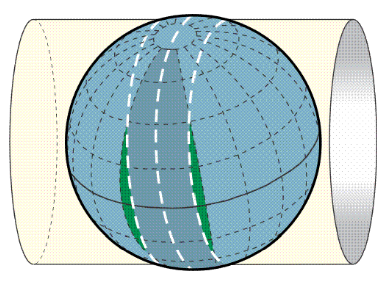

### Map

- Definition
  - a representation of the earth’s surface (or a part of it)
  - at a point of time
  - projected to the plane
  - scaled (down)
  - simplified (generalized)
  - labelled or commented
- Not a map
  - globes
  - aerial / satellite images
  - panoramic views
  - sketches
- Map design principle
  - harmony
  - composition / balance
  - clarity
  - level of abstraction
- Essential elements
  - title (→ purpose)
  - legend
  - spatial reference frame
  - north arrow
  - production information
- Cartographic generalization
  - Elimination
  - Simplification
  - Aggregation
  - Size reduction
  - Typification
  - Exaggeration
  - Classification
  - Displacement
  - Refinement
- Graphic variables
  - Size
  - Density
  - colour
  - shape
  - texture
  - orientation

## Week 2

### Properties of spatial raster data

- Granularity
  - “resolution”
  - raster element size (geometric)
  - scale / number of classes (thematic)

- Accuracy
  - “closeness to truth”:
  - raster coordinates vs feature location
  - raster integral vs feature size
  - raster value vs feature type/field property

- Meaning
  - coordinates, datum, projection
  - theme
  - units of geometric and thematic variables

- Value
  - economic value (for a decision)
  - price
  - ownership / usage rights
  - age

### Interpolation

- nearest(最近点的值)
- neighbour linear(值乘对角权重)
  - $V_{xy} = f(v_{00},v_{10},v_{01},v_{11}) = (1-x)(1-y)v_{00}+(x)(1-y)v_{10}+(1-x)(y)v_{01}+(x)(y)v_{11}$
- cubic

#### Contour line interpolation

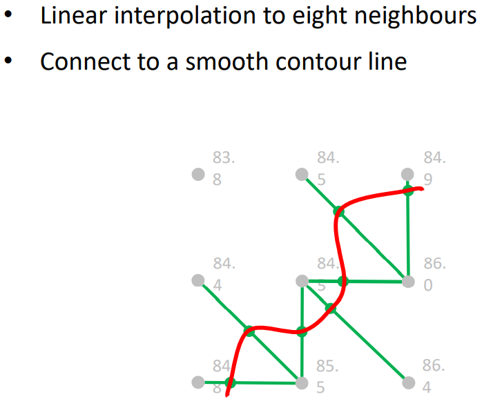

### Scale

= nominal(不可比较只有标签)  
<, =, > ordinal(只能比大小)  
<, =, >, – interval(定距变量，差值有意义)  
<, =, >, –, / ratio(定比变量，可以计算比例)

### Map algebra

#### Operations

- Local operations: consider multiple criteria
- Focal operations: smoothing, derivation
- Zonal operations: The value derived at a location is an aggregate of values of an input field, computed over a zone
- Global operations: The value at a location depends on all other values in the input raster

#### Slope in digital elevation model(DEM)

- Gradient: 与平面的角
- Aspect: 坡向, 和北方的夹角

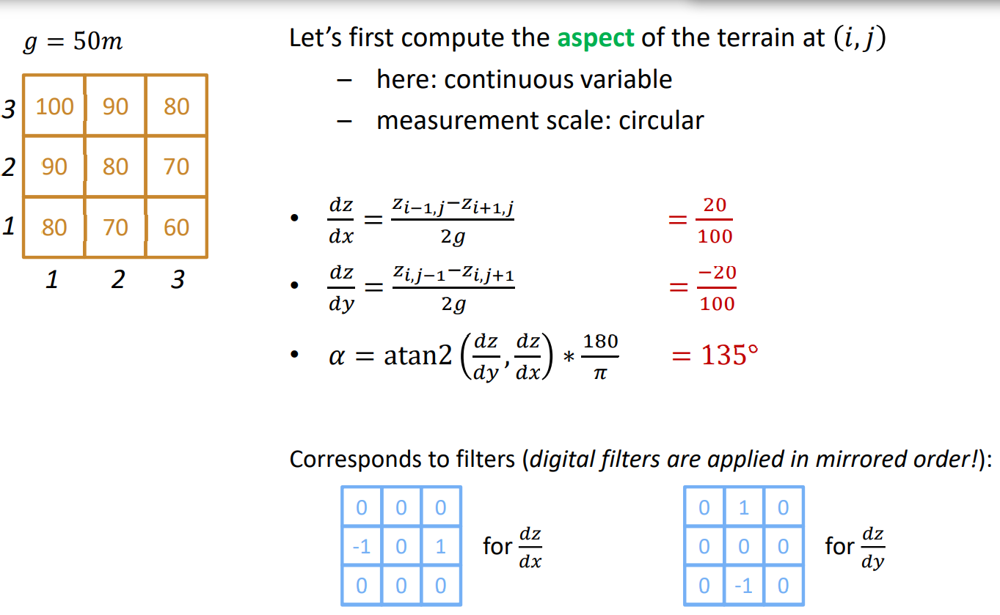
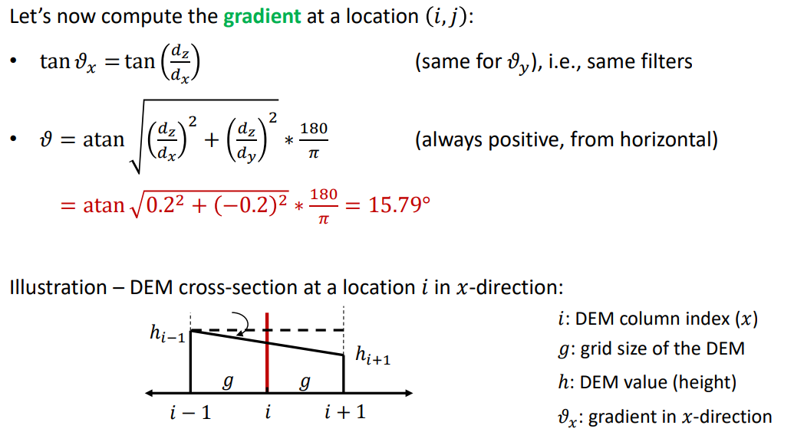

### Raster pyramid

- Image pyramids (from computer vision)
- Web map caches
- Region quadtrees(黑白灰)
  - Morton order (z) of indexing
  - fractal, space-filling curve
  - depth at most n for tessellation of $2^n \times 2^n$

## Week 3

### Polygon

**Jordan’s curve theorem**: A simple closed curve separates an interior from the exterior.

- Polylines
- Convex polygons
- Concave polygons

### Algorithm

#### Properties of an algorithm

- Correctness
  - test, or proof
- Efficiency
  - measured in comparison to input length
  - big-O notation: “order of complexity”
- Robustness
  - critical, especially with geometric operations

#### Distance

- Minkowski distance between points 𝑖𝑖 and 𝑗𝑗 in 2D
  - $d_{ij} = ((x_i - x_j)^p+(y_i - y_j)^p)^{1/p}$
- Manhattan distance
  - $d_{ij} = \Delta x + \Delta y$
- Euclidean distance
  - $d_{ij} = \sqrt{\Delta x^2 + \Delta y^2}$
- Chessboard distance
  - $d_{ij} = max(\Delta x, \Delta y)$

#### Centroid

Could be out of polygon  

$c_{xy} = \frac{\sum{xy_i}}{n}$

#### Area of polygon

- $2F = \sum{(y_i + y_{i+1})*(x_i-x_{i+1})}$
- **Go counter-clockwise**(逆时针)
- **Divide by two**

#### Point relative to line

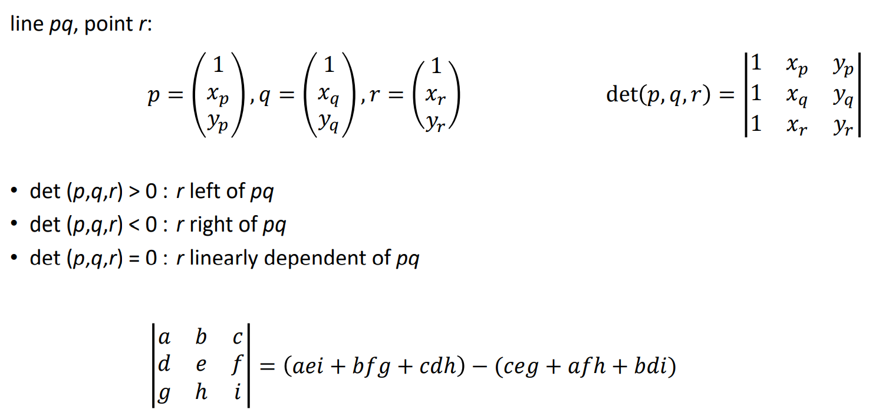  

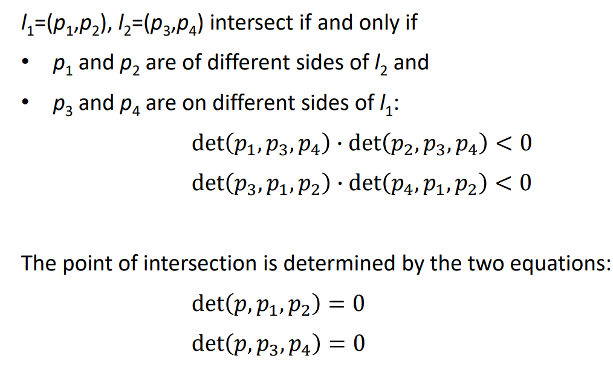

#### Point in polygon

- triangulation
  - If the point is inside of one of the triangles, then it is inside of the polygon
- line sweep algorithm (parity check)
  - If a ray intersects an odd number of times with the polygon the point must be inside (Jordan’s curve theorem)
- sum of angles to polygon nodes
  - If the sum of all angles from the point to the corners of the polygon (in the order of the horizon) is 360° then the point is inside the polygon

## Week 4

### Tree: connected acyclic graph

### Graph

- Undirected graph
  - unordered pairs of N
- Directed graph
  - ordered pairs of N
- Complete graph
  - a graph with E being a full set of pairs of N
  - The complete graph with n nodes is denoted by $K_n$.
- Bipartite graph
  - nodes N can be partitioned into two subsets X and Y such that each edge of G connects a node of X to a node of Y
- Planar graph
  - graph that can be drawn in the plane in such a way that no two edges intersect

#### Graph properties

- Degree: 连线数量
  - indegree: 指向的连线数
  - outdegree: 向外的连线数
- Walk: a connected sequence of edges
- Path: a walk with no self-intersection
- Cycle: a path with same start and destination node
- **Hamiltonian cycle**: A cycle that visits each node of G **exactly once**. (访问每点)
- **Eulerian tour**: A **closed walk** passing through each edge of G exactly once. (访问每条边一次)
  - Only graphs of even node degrees are Eulerian
  - A Eulerian tour may repeat nodes (self-intersect) but not edges.
  - A Eulerian tour corresponds to a Hamiltonian cycle in the line graph L(G) of G.
  - Not every graph has a Eulerian tour.
- Line graph
  - A line graph L of a graph G is a graph L(G) that represents the adjacency relations between edges of G

#### Centrality

- Degree centrality
  - degree
- Betweenness centrality
  - the proportion of optimal paths in this graph that pass through n(通过点的最短路径条数除以所有路径)

### Steiner

Given a set nodes N, interconnect them by a graph of shortest length. Intermediate nodes (Steiner points) may be added during the process.

**Rubber band**: All angles between incoming edges of a Steiner point are the same.

In regular polygons, the lowest network length L for N > 5 is the circumference less one side

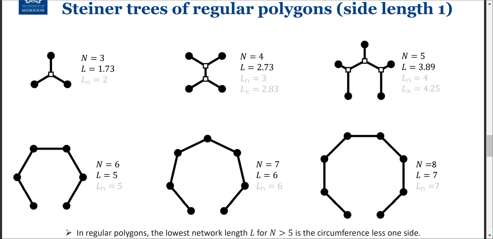

## Week 6

**Kyewords: partition**

A **spatial partition** (tessellation) is a subdivision of space that is jointly exhaustive and pair-wise disjoint(j.e.p.d).  

A **regular polygon** is a polygon with all edges having the same length and all internal angles being equal.(所有边和角相等的多边形)  

A **vertex figure** is a polygon formed by joining in order the mid-points of all edges incident with the vertex.(顶点边的中心点连线)  

A **regular partition** is a partition with all **polygons being regular** and equal, and all **vertex figures** being regular and equal. (equilateral triangles,
squares, hexagons)  

### Irregular partition

- Triangular irregular networks (TIN)
  - Minimal total edge length (choose a greedy algorithm)
  - Triangles “as equilateral as possible” (Delaunay)
  - Triangles observing linear constraints (e.g., river lines)
  - Efficient triangulation algorithm
- Voronoi diagrams
  - aka Voronoi tessellation, Thiessen polygons, Dirichlet tessellation

### Convex hull

The convex hull of a set X of points in Euclidean space is the smallest convex set that contains X.(最小包含所有点的凸集)

### Simplices

- 0-simplex: (0D) point
- 1-simplex: (1D) straight line segment
  - convex hull of two 0-simplices
- 2-simplex: (2D) triangle   - the simplest polygon
  - convex hull of three 0-simplices in linear independent positions(线性独立)

### Simplicial complex(多种simplex组成)

- a finite set of simplexes
- each face of a simplex is also in C;
- the intersection of two simplexes is either empty or also in C

### Cell

- 0-cell: (0D) point
- 1-cell: (1D) straight line segment
- 2-cell: (2D) simple polygon
  - linearly closed ordered set of n 0-cells in linear independent positions (n>2)

### General cell complex(不要求convex hull)

- a finite set of cells
- each face of a cell is also in C;
- the intersection of two cells is either empty or also in C

### Voronoi diagrams

两点连线中点的垂线作为分割线, 可基于Euclidean distance和Manhattan distance

### Delaunay triangulation

- Dual graph of the Voronoi diagram
  - $G^*$ is the dual of a planar graph $G$ if:
    - the faces of $G$ correspond to nodes in $G^*$.
    - the nodes in $G^*$ are connected if the corresponding primal faces have an edge in common(G中有临边, dual G 中有连线)
- Simplicial cell complex
- Triangular irregular network (TIN) such that
  - triangles have smallest circumcircles
  - triangles have largest minimal angles
  - for any two triangles abc and abd, d is not inside the circumcircle of abc
  - unique for any set of sites
  - contains always the convex hull of all sites

#### Iteratively adding another point

- If the added point falls inside an existing triangle, the triangle will be split in three.
- If the added point falls inside a circumcircle of an existing triangle (but outside of all existing triangles), the point will be connected and the shared edge will be swapped.
- If the added point falls outside of circumcircles of existing triangles, the point will be connected, preserving the convex hull.

**Number of faces**: $2^{n+1}-2$

## Week 7

**Kyewords: data modeling, normalisation**

### levels of data modeling

- transdisciplinary core spatial concepts: application-independent: fields, objects, networks, events
- application domain model: “roads”, “intersections”
- conceptual model: “points”, “lines”, “areas” (vector features)
- logical model: “nodes”, “arcs”, “areas” (relational tables)
- physical model: files, links, indexes

### ACID principles of DBMS

- Atomicity (“all or nothing”): if one part of the transaction fails, the entire transaction must be rejected
- Consistency: a transaction applied to a valid state must produce a valid state 
- Isolation: concurrent transactions must be executed as if they were executed serially
- Durability: once a transaction has been committed it must be stored in persistent memory
  
#### Why ACID is challenging for GIS

- in GIS complex transactions (multiple connected layers / topology)
- no history / no temporal data type

### Characters of spatial data

- Multidimensional
  - Sorting (by any column) does not preserve neighbourhood
  - Near things are stored far from each other (-> indexes)
- deeply connected
  - A parcel’s boundary is also the neighbouring parcel’s boundary, and potentially a suburban boundary
  
### Spatial database models

- hierarchical(树)
- network(网)
- relational(表)
- object-oriented
- graph(图)
  - connectivity is more important than individual data points
  - relationships are explicit, not just temporarily calculated
  - no need to infer data connections using things like foreign keys (indexfree adjacency)
  - Data is stored as key-value pairs in attributes of elements

### Relational data modeling

#### Tables are in normal form (normalisation)

- each attribute is atomic(属性独一无二)
- every non-key attribute is dependent on the key(所有和key相关)
- all non-key attributes are mutually independent(非key之间不相关)

**Relational ‘spaghetti’**: Represents nodes, arcs, and areas without an explicit representation of the topological interrelationships of the configuration

- A convex hull is the smallest convex polygon that contains a set of points
- The model is not normalised
- The model stores redundant data

### Redundancy

Dependent data, such as coordinates and size of polygons, are redundant. Normalisation is a database design technique that reduces such data redundancy.

#### Insert, update, delete, query infected by redundancy

- Infection
  - Pros
    - Query would be more efficient. Why? Dependent information are already computed and stored in the database (think about coordinates and size of polygons)
  - Cons
    - Insert, update and delete would be more difficult. Why? More records (the data and their dependents) should be inserted, updated or deleted.
- Trade-off bewteen query and insert/update/delete

#### Data warehouse

- Store redundant data (in data cubes often aggregated by time and space)
- The frequency of querying is significantly more than inserting, deleting and updating
- In data warehouse design, we precompute values and consequently store redundant information!

#### Node-arc-area consistency

- Each (directed) arc has exactly one start and one end node.
- Each node must be the start node or end node (maybe both) of at least one directed arc.
- Each area is bounded by one or more directed arcs.
- Directed arcs may intersect only at their end nodes.
- Each directed arc has exactly one area on its right and one area on its left.
- Each area must be the left area or right area (maybe both) of at least one directed arc.

### Spatio-temporal data modeling

#### Time density

- Continuous
  - time line is isomorphic to real numbers (chronon: an instant)
  - between each pair of chronons is an infinite number of chronons
  - allows for instantaneous events and continuous change
- Discrete
  - time line is isomorphic to integer numbers (chronon: a period)
  - time line is composed by a sequence of (atomic) chronons
  - between each pair of chronons is a finite number of chronons
  - finite sequences of chronons: granules
  - allows only for extended events

## Week 8

**Keywords: Observing mobility, space time prism, trajectory, Hidden Markov Model**

### Frames of reference

**Field view**(counts) vs **Object view**(individual movement)  

**Continuants**: entities that have continuous existence(持续变化)  
**Occurrents**: events and changes(在某个时间点偶发)  

**Lagrangian frame of reference**: The observer follows an individual fluid parcel as it moves through space and time.The observer follows an individual. (在运动物体上)  
**Eulerian frame of reference**: The observer focuses on specific locations in the space through which the fluid flows as time passes.The observer focuses on specific locations in the space through which the individual passes.（在固定位置上）  

Preserving location privacy:

- Anonymizing trajectories
- Adding noise to locations and time
- Generalizing the location into suburb or LGA level

### Trajectory

In physics, a trajectory is the path that an object with mass in motion follows through space as a function of time  
In spatial information, a trajectory is observed and represented by a discrete sequence of coordinate values and time  

**Potential Path Area** (PPA) is the projected space-time prism in the geographical space.  

#### The resolution, or sampling frequency

- completely irregular: triggered by event
- spatially triggered: new registration when certain distance threshold has been reached
- temporally triggered: new registration when certain time threshold has been reached

#### Properties of a discrete trajectory

- Uncertainty
- Speed: first derivative $(\partial x/\partial t)$
  - computed by sliding time windows, such as [−1 0 1]
- Acceleration / deceleration: second derivative $(\partial x/\partial t)^2$
  - computed by sliding time windows, such as [−1 2 -1]

### Markov model

**Markov process**: sequence of events where the probability of each event depends only on the state attained in the previous event.

**Trajectories as a Markov process**: sequence of observed visited locations where the probability of visiting the next observed location depends only on the last observed visited location.

## Week 9

**Keywords: Qualitative, Topological relation**

**Qualitative information**: information about qualities (qualitative properties无法量化的观测到的信息)humid, tall, strong  

**Qualitative relations**: qualities of a relations that are not measurable. in front of(qualitative relative direction), not too far(qualitative distance), before(qualitative order), in(qualitative topological relation)  

### Qualitative spatial relations

- Topological relations
  - invariant to reference frames
  - invariant under topological transformations
- Cardinal direction relations
  - absolute reference frame
- Relative direction relations
  - various reference frames
- Distance relations
  - context as reference frame
- Other qualitative relations
  - context

**Qualitative spatial reasoning**: 给定 AB，BC的关系，推断AC的关系（In many cases reasoning is ambiguous.）  

### Topological relations of regions

i: interior, e: exterior, b: boundary  
4-intersection matrix: describes the relation between two simple regions A and B  
9-intersection matrix: describes the relation between any two regions (or lines, or region and line) A and B

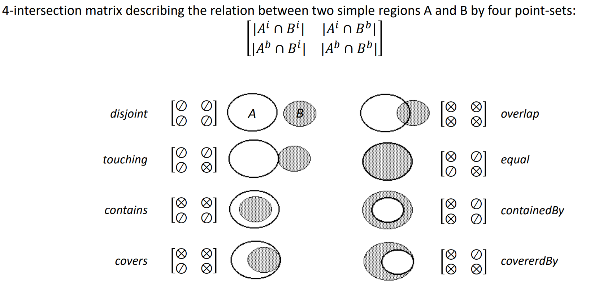
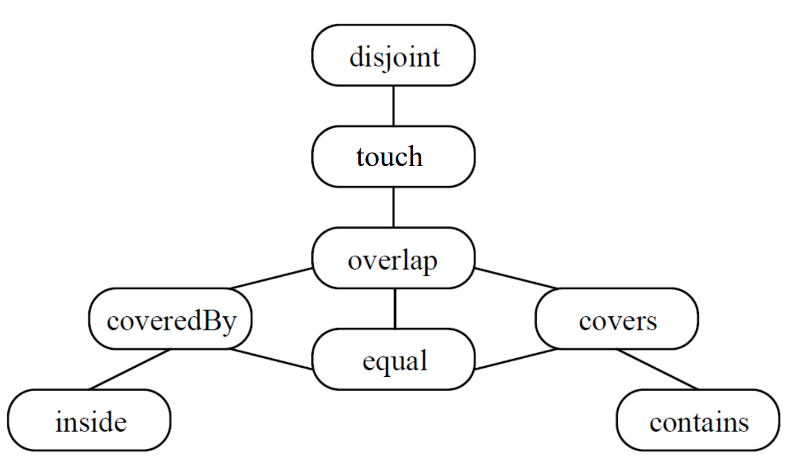

### Directions and distances

- Cardinal direction relations
  - Half-plane
  - Sector
- Relative direction relations
  - Relative perspective: dependent on the speaker’s position towards the object
  - Absolute perspective: based on cardinal directions such as north, east, south, and west
  - Intrinsic perspective: describes the location of an object using the relation towards another object
  - Egocentric perspective: related to speaker’s body
  - Projected egocentric: related to the recipient’s body  

## Week 10

**Keywords: Ontology, Quality, Measurement**  

Ontology: studies concepts that directly relate to being, in particular becoming, existence, reality, as well as the basic categories of being and their relations.

### Ontological commitment

- An information community
- A taxonomy of features
- An agreement of the properties of features, including their relations

#### GIS task

- capture
- management
- analysis
- visualization
  
### Quality

#### Core concept

- Granularity/ level of detail
- Accuracy
- Completeness
- Provenance
  
#### Provider data quality

- Currency
- Completeness
- Accuracy
- Consistency
- Accessibility

### Sampling theorem

If a function 𝑥(𝑡) contains no frequencies higher than 𝑓 Hz, it is completely determined by giving its ordinates at a series of points spaced 1/(2𝑓) seconds apart.

### Position in the plane

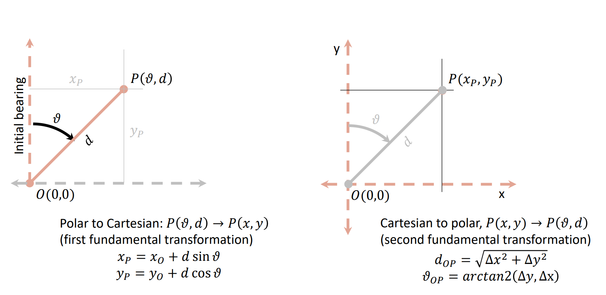

### Measurement in positions in 2D

- Measurement of direction and distance
  - Compass and steel tape
  - Total station (theodolite and electronic distance meter)
  - Laser scanner
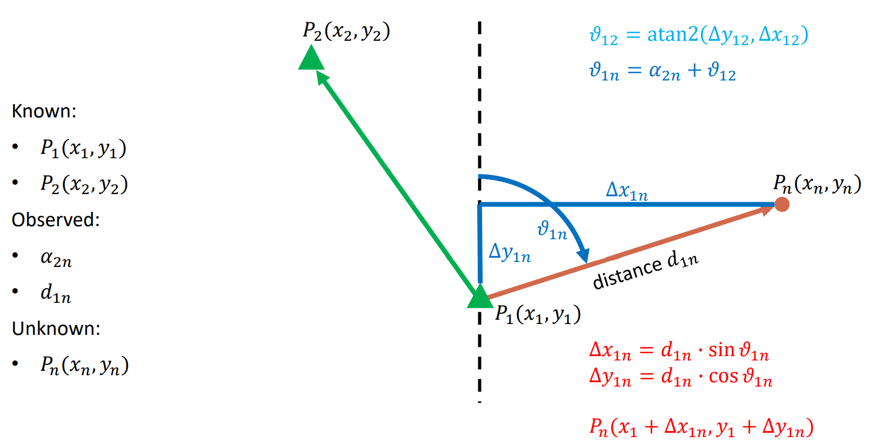
- Measurement of distances only
  - Steel tape
  - Electronic distance meter (laser)
  - GNSS (time differences in radio signal)
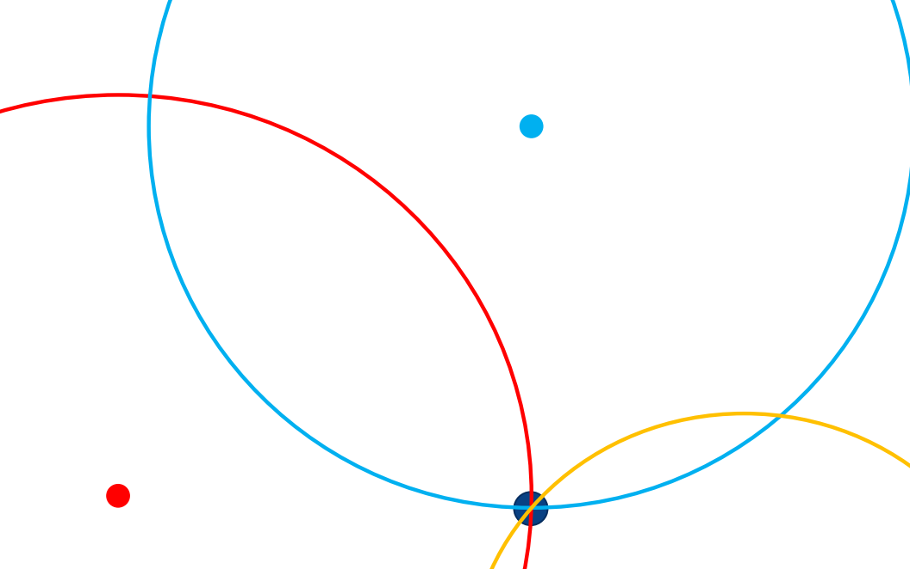
- Position in three-dimensional space:
  - Single observation: location on a sphere
  - Two observations: intersection of two spheres (circle)
  - Three observations: intersection of three spheres (ambiguous)
  - Four observations: intersection of four spheres (singular solution)

- Measurement of directions only
  - Photogrammetric bundle adjustment
  - Resection

## Week 11

**Keywords: information product, cost benefit, project management**

### Information product

- very high development costs
- very low production costs
- easy to reproduce (at nearly no costs)
- use does not consume product
- transaction costs paid by buyers

### Value Cost Price

- Value
  - bettr decision
  - faster decision
  - cheaper decision
- Cost
  - data capture/ licence fees
  - infrasctructure/ technology
  - expertise personnel
- Price(market driven, negotiable)
  - utility
  - elasticity
  - competing products

### Cost benefit analysis

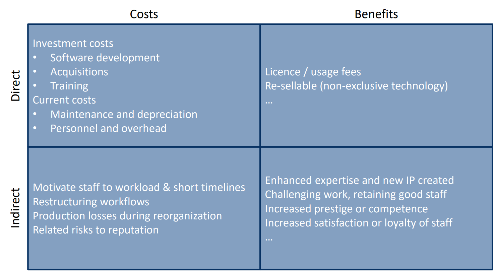

### Cost benefit ratio

**Conservative approach:** $\frac{costs}{benefits} = \frac{direct costs + indirect costs}{direct benefits}$  

**Go-ahead condition**:

- Cost-benefit ratio smaller than 1.
- Graph of accumulating costs and benefits should show a break-even (in a reasonable time frame)
  - Break even: Point in time where benefits equal costs (return of investment)

**Expectations**:

- Short term projects must reach break-even before project end
- Long term projects should reach break-even realistically

### Software development processes

1. requirement analysis
2. software design
3. implementation
4. testing
5. maintenance

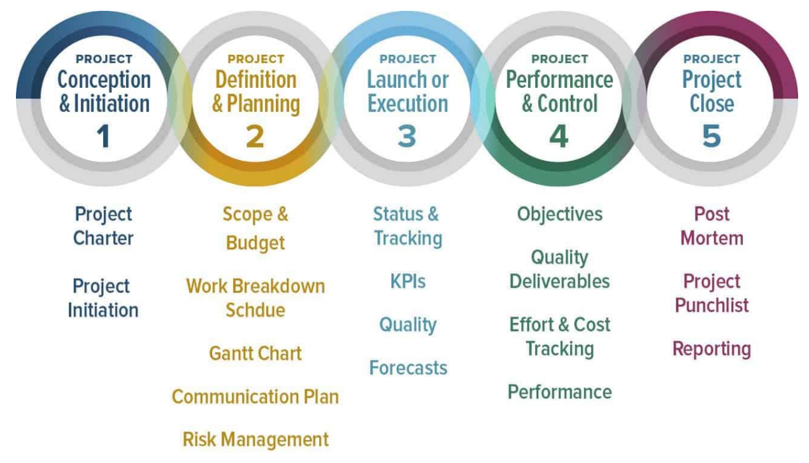

### Project phase

1. Project Concept & Initiation
2. Project Definition and Planning
3. Project Launch and Execution
4. Project Performance and Control: Progress Tracking
5. Project Closure

### methodologies for management of software development projects

- The **Waterfall model** is a sequential development approach. Every phase requires
completion before a new phase can start. Such a model type is essentially utilized for projects which are smaller and do not entail any uncertain requirements.
- The **Agile model** is an incremental model based on principles that focuses more on people, results, collaboration, and flexible responses to change. Uses sprints (short cycles) to enable someone to focus on continuous improvement of a service or a product. Ideally, it reduces the complexity that many months-long cycles have, by breaking them down into the most crucial concepts to cash for the entire project.

### Business model

- **Fixed price model**: Customers pay once to access a service or product.
- **Subscription model**: Customers pay recurring payments on a monthly basis (or another specified timeframe) for access to a service or product.
- **Freemium model**: The company hosts and provides a proprietary tool for their users to freely access and limits the use of certain key features

## Week 12

**Keywords: Ethics, Profession**  

### Proffesional ethics

- **Ethics**: a system of moral principles governing the appropriate conduct of a person or a group.  
- **Professional ethics**: a system of moral principles govering the appropriate conduct of a person or a group in the profession.  
  - **Business-society relations**: law, equal opportunity
  - **Business-customer relations**: contracts, proprietary and confidential information
  - **Employees’ personal conduct**: superior-subordinate, subordinate-superior, and peer relations
  - **Profession relations**: professional standards, and reporting/reviewing procedures

### URISA’s Code of Ethics for GIS professionals

- **Obligations to Society**
  - Do the best work possible
  - Contribute to the community to the extent possible, feasible, and advisable
  - Speak out about issues
- **Obligations to Employers and Funders**
  - Deliver quality work
  - Have a professional relationship
  - Be honest in representations
- **Obligations to Colleagues and the Profession**
  - Respect the work of others
  - Contribute to the discipline to the extent possible
- **Obligations to Individuals in Society**
  - Respect privacy
  - Respect individuals

### Do the best work possible

- **Ethics in conventions**: Facts from GIS
- **Ethics of selection**: Which facts
- **Ethics in presentation**: facts in maps
- **Ethics in truthfulness**:“Alternative facts”, fake

### Utterances

- **A locutionary act**: the actual utterance and its apparent meaning
- **An illocutionary act**: the active result of the implied meaning
- **A perlocutionary act**: the actual effect of the utterance  

Be aware of all three acts underlying any visual communication.  
Maximise the locutionary act and its illocutionary force, and minimize the perlocutionary act(呈现真相，解释真相，不做引导)

### Bias/ partisan cartography

- Cartography by parties in conflict:
  - Partisan demarcations and sovereignty claims
  - Deliberate projections
  - Propaganda
- Cartography with partisan interest:
  - Biased use of colour schemes / visual communication 
  - Biased samples
  - Biased use of statistics